Deployment Configuration
========================

.. warning:: Some of the screenshots may look different than the ones shown here. The
   difference in all cases should be cosmetic and not affect operations.

The purpose of this section is to walk through the deployment configuration options in
enStratus. 

In the `Overview <../introduction/overview.html>`_ section, we covered the concepts
involved with creating an enStratus deployment.

.. note:: 
  Before approaching deployment configuration, you should have in hand the
  following components:

  #. Working machine images/templates with the enStratus agent installed and tested.
  #. Service images for each application/database to be installed.

enStratus knows about is the environment in which your application/database runs and it
will inform your services about that environment. 

enStratus gives you all the tools to deploy and manage a fully automated environment.

User Interface
~~~~~~~~~~~~~~
The enStratus automation interface is designed to be intuitive and easy to operate. There
are several sections of the enStratus console that are relevant to interacting with and
configuring automation.

The deployment designer interface allows the user to build an application architecture
using the enStratus web console. 

Diagram
%%%%%%%

.. figure:: ./images/deploymentDiagram.png
   :height: 530px
   :width: 700 px
   :scale: 70 %
   :alt: Deployment Designer
   :align: center

   Deployment Designer (Diagram View)

Table
%%%%%

This deployment has two tiers tier and two launch configurations in one region. The
graphical representation of the deployment can also be toggled to a table view.

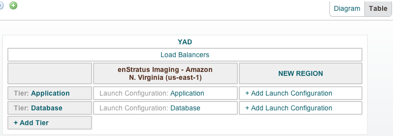

   Deployment Designer (Table View)

Deployment Dashboard
%%%%%%%%%%%%%%%%%%%%

The deployment dashboard is meant to display relevant statistics and other information to
deployment administrators.

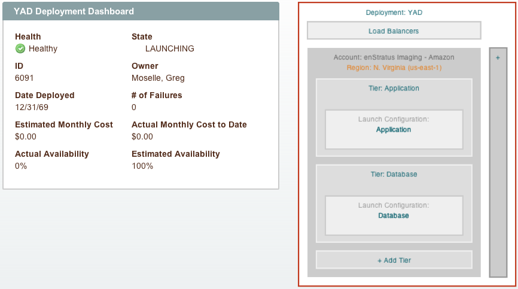

   Deployment Dashboard

Deployment Management
~~~~~~~~~~~~~~~~~~~~~

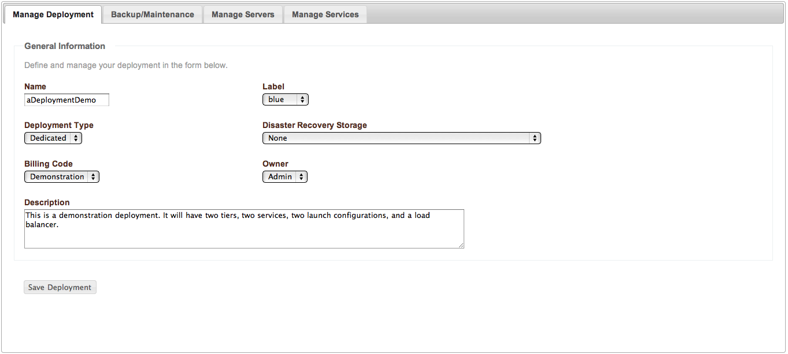

   Deployment Management

Deployment management and configuration starts  with the options shown in the figure
above.

#. **Name**

   The name of the deployment is simply the logical name that will be presented in the
   enStratus console. 

#. **Label**

   An optional color code may be applied to the deployment.

#. **Deployment Type**

   The deployment type has two options:
   
   * Dedicated. 

     A dedicated deployment will track all deployments costs against the same
     billing code.

   * Shared. 

     A shared deployment will track deployment costs against multiple billing codes.
     If a shared deployment is chosen, billing code usage will be tracked at the service level.

#. **Disaster Recovery Storage**

   Disaster recovery storage specifies a cloud storage option for backup files. It is
   possible to run all or parts of a deployment in one cloud while performing backups via
   /enstratus/bin/backupService to another cloud altogether for disaster recovery purposes.

#. **Billing Code**

   The billing code is the code against which all deployment charges will be made.

#. **Owner**

   The owner specifies an optional owner for the deployment so that role based access
   controls may apply to the deployment.

#. **Description**

   The description is a free form text field for describing the deployment.

Backup/Maintenance
%%%%%%%%%%%%%%%%%%

.. figure:: ./images/backupMaintenance.png
   :height: 600px
   :width: 1500 px
   :scale: 50 %
   :alt: Backup and Maintenance
   :align: center

   Backup and Maintenance

The backup options designate the times when enStratus will peform backups such as
snapshots of attached volumes or service level backups via the agent script
/enstratus/bin/backupService.

Manage Servers/Services
%%%%%%%%%%%%%%%%%%%%%%%

These tabs display an aggregated view of all servers running in the deployment and all of
the services installed on the deployment.

Load Balancers
~~~~~~~~~~~~~~
A load balancer balances traffic typically to multiple application servers. enStratus
supports multiple types of load balancers through different mechanisms.

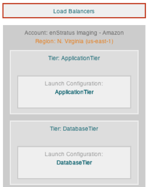

   Load Balancer

Physical
%%%%%%%%

A virtual machine based load balancer can use HA-Proxy, mod-jk, or zeus as a load
balancer. When a service is connected to a virtual machine based load balancer, The agent
script /enstratus/bin/startProxy is used to signal the load balancer that a new
application server has joined the pool. The agent script /enstratus/bin/stopProxy is used
to signal the load balancer that an application server has left the pool.

Virtual (Example: ELB)
%%%%%%%%%%%%%%%%%%%%%%

Some cloud providers support service-based load balancing in the from of a virtual load
balancer. In AWS, this is called an Elastic Load Balancer (ELB). In cloudstack (cloud.com)
clouds, sometimes this is called a Router Virtual Machine (RVM). If your cloud provider
has this concept with API support, enStratus can support it.

If a service is tied to a virtual load balancer, the server upon which that service runs
will be added to and dropped from the load balancer via api calls. Furthermore, if the
load balancer is set to balance traffic to a specific zone or zones, enStratus will ensure
that your application servers only start in those zones.

Load balancing is connected to the deployment at the *service* level with enStratus. An
important point which will be illustrated shortly.

.. note:: It is possible to associate multiple load balancers with a deployment. This
  feature is useful when working in a cross-cloud or in a massively scaled, geographically
  disperse environment.

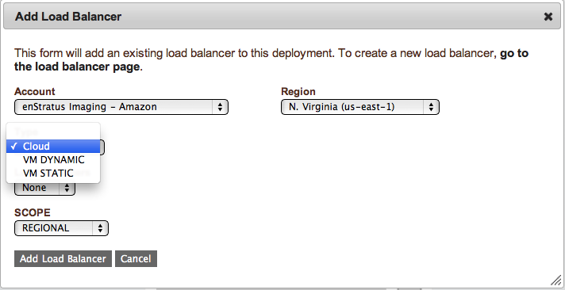

   Adding a Load Balancer

Load balancer configuration options are:

#. **Account**

   The account specifies the account to which the load balancer is provisioned. If the
   administrator is a member of multiple accounts, there may be multiple options here.
   One possibility here is to have a load balancer span across several clouds. For example, a
   load balancer may be provisioned into a cloud.com cloud with application servers in both
   EC2 and in cloud.com

#. **Region**

   It is possible to have a load balancer span regions within a cloud. For example, the EC2
   cloud has at the time of this writing 5 regions.

#. **Scope**

   The scope parameter has three different settings:

  * **Global**
    
    A global setting will cause the load balancer to balance across regions, but is
    nonsensical for virtual load balancing offerings such as an ELB.

  *  **Regional** 

     A regional load balancer will balance traffic to only one region, and evenly
     to all data centers within that region.

  * **Data Center** 

    A data center setting will balance to specific data centers. This type of
    load balancing only makes sense for virtual load balancing offerings such as an ELB where
    data centers (zones) can be specified prior to launch. This setting is non-sensical for
    VM-based load balancing where no such option exists.

There are three types load balancer that can be provisioned within enStratus:

#. **Cloud**

   A cloud load balancer is a virtual load balancer such as an Amazon EC2 Elastic
   Load Balancer. If the cloud provider has no such concept, there will be no option
   presented.

   In order for this option to be presented, a cloud load balancer must have already been
   provisioned.

#. **VM Dynamic** 

   A VM Dynamic load balancer means that at the time of deployment start,
   enStratus will provision a virtual server from the specified template with the appropriate
   resources, and launch it into the specified fireall. If a VM Dynamic load balancer is
   provisioned, it will benefit from auto-recovery.

#. **VM Static** 
   
   A VM Static load balancer will "convert" an existing virtual machine
   into a load balancer by calling the /enstratus/bin/startProxy script on the VM specified
   at the appropriate time.

   Currently, VM Static load balancer do not benefit from auto-recovery. If auto-recovery is
   desired, use a VM Dynamic load balancer instead.

Machine Images/Templates
~~~~~~~~~~~~~~~~~~~~~~~~
.. note:: Creating "golden" or "master" images is common practice. Best practice is to
  utilize tools that are specially suited the task of configuration management. enStratus
  can leverage the power of both Chef and/or Puppet. enStratus also offers its own
  configuration management engine that is a good introduction to the concept.

A machine image is a template from which servers are started. This document assumes a high
degree of familiarity with the process of image creation and maintenance. Methods for
maintaining machines with respect to versioning will be addressed. In an automated
environment, the enStratus agent *must* be installed on a template prior to configuring a
deployment.

Versioning
%%%%%%%%%%

If you are operating in a deployment, enStratus can help you manage the version of machine
image you are using in your launch configurations. This concept is addressed as part of
the auto-rollout feature of enStratus.

In short, you should patch servers running in your deployment as you see fit, and ensure
you maintain an equally patched version of the AMI defined in your launch configuration so
that when/if a scale or recovery event occurs, you utilize the correct machine image
version for the newly created servers.

Dependencies
%%%%%%%%%%%%
enStratus has very few true dependencies. It depends on Java, so ensure you have the
latest JDK installed to support the Agent. Additionally, when you are operating in an
automated deployment environment, we recommend installing the following software:

.. tabularcolumns:: |l|l|l|
+-------------------+----------------------------------+--------------+
| Package           | Purpose                          | Note         |
+===================+==================================+==============+
| zip               | Backups                          | Recommended  |
+-------------------+----------------------------------+--------------+
| openssl           | Adding Users                     | **Required** |
+-------------------+----------------------------------+--------------+
| unzip             | Service install, backups         | Recommended  |
+-------------------+----------------------------------+--------------+
| build-essential   | OSSEC installation and more      | Optional     |
+-------------------+----------------------------------+--------------+
| xfsprogs          | XFS filesystem functionality     | Optional     |
+-------------------+----------------------------------+--------------+
| libapache2-mod-jk | mod_jk load balancing            | Optional     |
+-------------------+----------------------------------+--------------+
| postfix           | Sending mail notifications       | Optional     |
+-------------------+----------------------------------+--------------+
| cryptsetup        | Encryption (LUKS)                | Recommended  |
+-------------------+----------------------------------+--------------+
| haproxy           | Load Balancing                   | Optional     |
+-------------------+----------------------------------+--------------+
| cronolog          | Logging                          | Optional     |
+-------------------+----------------------------------+--------------+
| sysstat           | OS metrics                       | **Required** |
+-------------------+----------------------------------+--------------+
| secure-delete     | Securely delete files            | Recommended  |
+-------------------+----------------------------------+--------------+
| mysql-server      | Running MySQL Databases          | Optional     |
+-------------------+----------------------------------+--------------+
 
Services
~~~~~~~~
Services are software objects in the form of files, typically tarred, zipped, or gzipped.
Services must be uploaded to cloud storage before configuring the deployment.

A service "image" is a zip file that can be uploaded to enStratus and then selected for
use in an automated deployment environment. Services are installed on tiers, and have
several configuration options, one of which can accomplish the logical connections between
services known as dependencies.

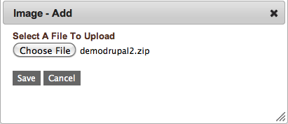

   Add Service Image

To upload a service image, navigate to Automation > Service Images and select a service
image from your local file system. Once the service image is finished uploading, it will
be available as an option for use in a tier.

Data Sources
~~~~~~~~~~~~
To upload a data source into enStratus, navigate to Automation > Data Source Images and
select add data source.

A data source can be a database backup file. For example, for a MySQL database, the data
source may be represented by a file with a .sql extension. This file is downloaded from
cloud storage during the start and configuration of a service that has associated a data
source.

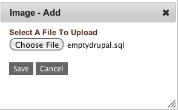

   Add Data Source

Using
%%%%%

Data sources are used when configuring a service. More is said about this in the
section on Tiers, which hold services. A data source is a database backup file, typically
in the form of a "dump" file of the form database1.sql. Data sources, like
services, should be uploaded into cloud storage before configuring the deployment.

Volumes
~~~~~~~
Volumes will be provisioned automatically by enStratus during deployment start according
to the parameters set as part of the launch configuration. enStratus uses volumes if they
exist with the cloud provider to execute scaling and recovery events.

Volumes are mounted on servers running in a tier at /mnt/services for Linux servers and at
H:/services for windows servers. Services are automatically assigned a serviceID which
becomes a directory within /mnt/services or H:/services of the form a1234. The path to the
service will be of the form /mnt/services/a1234, where a1234 is an automatically generated
identifier.

Launch Configuration
~~~~~~~~~~~~~~~~~~~~

A launch configuration is a definition that governs the resources provisioned to support a
virtual machine. At one level, this is roughly analogous to the size definitions provided
for by some clouds, such as in Amazon AWS small, medium, large, etc.  For enStratus a
launch configuration includes this definition, but goes beyond to include attaching,
raiding, and encrypting volumes as well as the firewall into which the server is started.

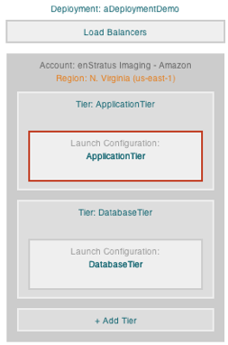

   Launch Configuration

Manage Launch Configuration, General Information
%%%%%%%%%%%%%%%%%%%%%%%%%%%%%%%%%%%%%%%%%%%%%%%%

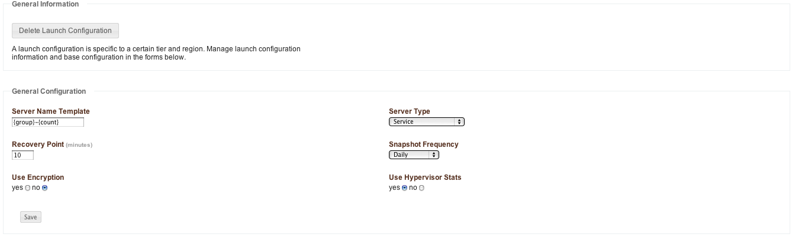

   Launch Configuration (General Information)

#. **Server Name Template**

   The server name template controls the name that is applied to servers that are started
   according to the launch configuration. There are two approaches to naming servers as part
   of the launch configuration.
   
   The first approach is to just hard code a value for this field. The implications of this
   are if the tier scales to include many servers, they will all be named the same thing,
   which is allowed, and not always desirable.
   
   The second approach is to use parameters as shown in the figure above. The available
   parameters are:
   
   * {tier} name of the tier this server is running in.
   * {group} currently resolves to tier name, for backwards compatibility.
   * {count} count of this server (sequential numbering from 1 for a tier.)
   * {role} one of: CLUSTER NODE, INDEPENDENT NODE, MASTER, REPLICANT, STANDALONE (converted
     to lowercase string)
   * {type} one of: LOAD, SERVICE, CLUSTERED DATABASE, REPLICATED DATABASE, UNKNOWN
     (converted to lowercase string)
   * {zone} the provider zone ID where the server is running.
   * {dc} resolves the same as zone above.
   * {region} the provider region ID where the server is running.
   * {ip} reserved address (public IP) of the server.
   * {year} launch year of the server.
   * {day} launch day of the server.
   * {hour} launch hour of the server.
   * {minute} launch minute of the server.
   
   This approach has the advantage of uniquely naming servers as they join/leave a tier in an
   intelligent manner.

#. **Recovery Point**

   The recovery point parameter sets the amount of time enStratus will wait to begin a
   recovery event of a failed server. A server is assumed to have failed if the agent is
   unreachable, and the server is un-ping-able, or the server has stopped altogether and is
   no longer being counted in the min/max.

#. **Use Encryption**

   This setting determines whether volumes attached to servers are encrypted. This option is
   currently only meaningful for Linux-based servers that can employ the Linux Unified Key
   Setup. This type of encryption is file-system based encryption.

#. **Server Type**

   There are five options for Server Type:

   * Load balancer. This option specifies a launch configuration as a load balancer so
     that servers in this tier will be treated as such.
   * Service General Service. This option identifies the servers governed by this launch
     configuration as a generic service such as a web application.
   * Clustered Database A clustered database is a database that is not using replication and
     is therefore treated as an independent entity.
   * Replicated Database A replicated database is a database that is set up to perform
     replication.
   * Unknown Similar to a service, this is a generic entry for a service.

#. **Snapshot Frequency**

   This parameter sets the frequency with which enStratus automatically performs snapshots of
   the attached volume. It is important to note that although there may be multiple servers
   running as part of a tier, each with its own volume attached, enStratus will only snapshot
   one of the volumes.
   
   This highlights an important architectural consideration. Each server running in a tier
   should be identical, as should the attached volumes. If variation is required in the
   architecture between servers, that is an indication that an extra tier should be
   configured.
   
   Take care not to set the snapshot frequency too low. Snapshots lock the file system until
   they are complete, which can impact your application performance. Additionally, most cloud
   providers limit the number of snapshots that can be stored and if the setting is to a high
   frequency, this limit may result in errors. Typically one snapshot per day is sufficient
   for most applications.

Machine Images
%%%%%%%%%%%%%%

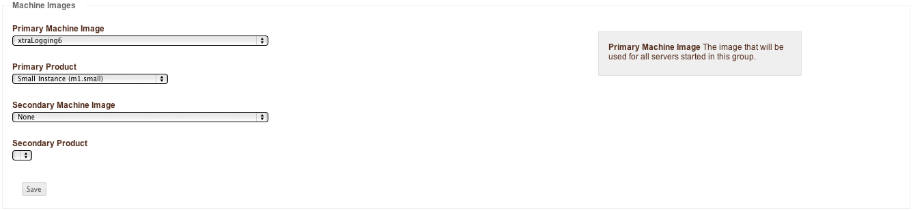

   Launch Configuration Machine Images

#. **Primary Machine Image**

   The primary machine image specifies the machine image that enStratus will use to start
   servers in the tier.

#. **Primary Product**

   The primary product will contain a list of options that is very cloud-specific. The figure
   shows an option that is specific to the AWS EC2 provider. If you are using a different
   cloud provider you will see other options present here.

#. **Secondary Machine Image**

   The secondary machine image is a machine image of an optionally unique definition that 
   enStratus will use to launch subsequent servers from the secondary machine image definition.
   
   The most logical implementation for using a secondary machine image is in the case of
   replicated databases. The primary machine image would be used by enStratus to launch the
   master database and all subsequent servers would function as slaves using the secondary
   machine image.

#. **Secondary Product**

   The secondary product defines the amount of virtual hardware provisioned in the same
   manner as the primary product.

Volumes
%%%%%%%

.. note:: The volumes option is only present if the cloud provider features block storage.

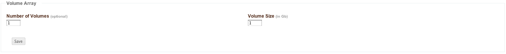

   Launch Configuration, Volumes

The volumes specification determines the number and size of volumes that will be attached
to servers in the tier. The option to encrypt these volumes is specified as part of the
general configuration above.

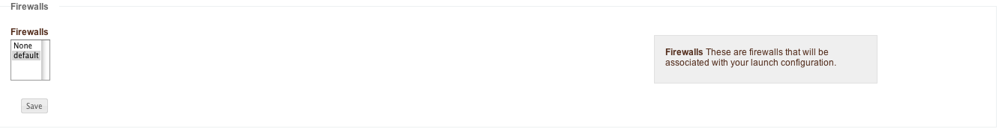

   Launch Configuration, Firewalls

The firewall definition specifies the firewall into which servers in this launch
configuration are started.

Manage Servers, Servers
%%%%%%%%%%%%%%%%%%%%%%%

Selecting this tab will show the servers running as part of the selected launch
configuration.

Tier
~~~~
A tier is a logically and physically scalable division that contain servers running. Tiers
may span one or more clouds, so it is possible to have a tier that starts by provisioning
servers in your private data center but "bursts" when demand dictates additional
infrastructure into a public cloud provider.

A launch configuration is logically contained within a tier. In fact, a tier cannot exist
in any region without a corresponding launch configuration.

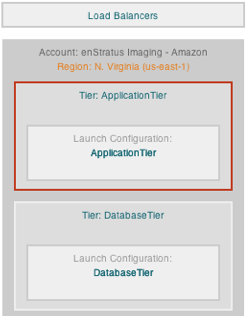

   Tier

Manage Tier, General Information
%%%%%%%%%%%%%%%%%%%%%%%%%%%%%%%%

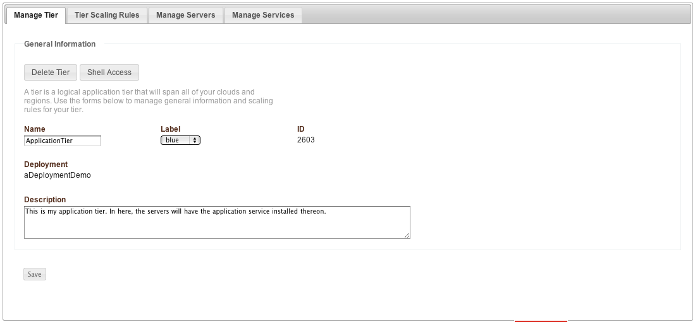

   Tier, General Information

Managing a tier includes the capability to delete the tier or grant shell access for the
tier. If the tier is deleted, any associated launch configurations will also be deleted.
If the shell access option is selected, a dialog box will be presented to the
administrator for adding shell access to servers running in the tier.

Manage Tier, Shell Access
%%%%%%%%%%%%%%%%%%%%%%%%%

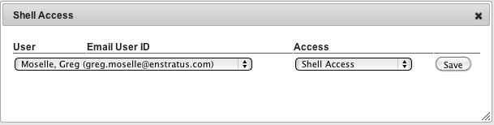

   Tier, Shell Access

When servers are started as part of ongoing tier operations, Users designated for shell
access will be granted shell access shortly after the server has registered with the
enStratus provisioning server.

The same requirements for shell access in individual servers apply, namely that the
firewall must be open on the port where SSH is running, and the user must have a public
key as part of their profile.

Tier Scaling Rules, Scaling Rules
%%%%%%%%%%%%%%%%%%%%%%%%%%%%%%%%%

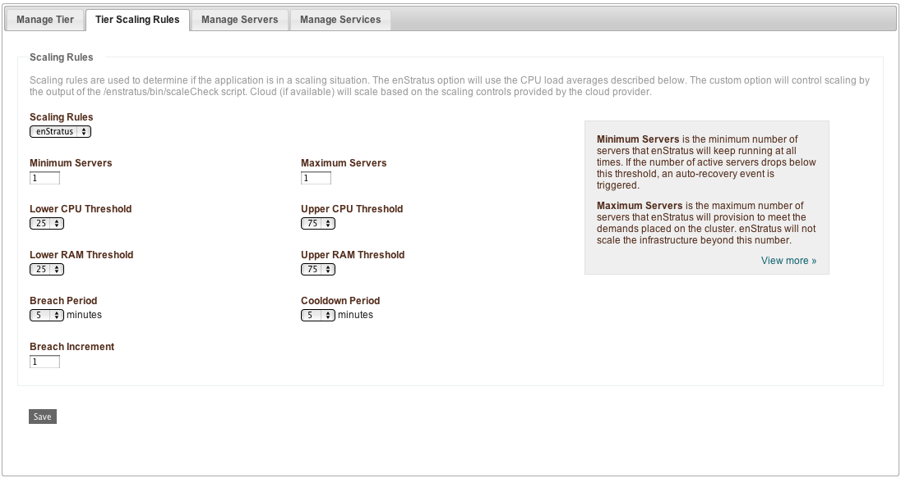

   Tier, Scaling Rules

Scaling rules are where the parameters that govern the scaling of tier resources.

#. **Minimum Servers**

   The minimum servers specification sets the minimum required number of servers that must be
   kept running in the tier at all times. If the total number of running servers in the tier
   falls below this threshold, an auto-recovery event will be triggered.

#. **Maximum Servers**

   The maximum servers specification sets the maximum allowable number of servers for a tier.
   If the demand on the tier is such that additional server resources are required, enStratus
   will scale up to, but not exceed, this value.

#. **Scaling Rules**

There are three options for scaling rules:

   1. **enStratus** 

      enStratus scaling options are the ones shown by default. Scaling behavior is
      governed by certain "hardware" parameters described here.
   
      enStratus can govern scaling events by monitoring the CPU load of the servers. The CPU
      load is equal to: 15-minute load average/# of CPU. For example, if the system has 2 CPU
      and the load average is 0.89, the CPU threshold reading is 0.445*100 = 44.5.
   
      * Lower CPU Threshold. 
        The lower bound on CPU threshold. If the threshold drops
        below this level and there are more than the minimum number of servers running, 
        servers will be terminated due to the decreased demand.
   
      * Upper CPU Threshold
   
        The upper bound on CPU threshold. If the threshold rises above this level and there are
        less than the maximum number of servers running, servers will be started to meet increased
        demand.
   
      * Lower RAM Threshold
   
        The lower RAM threshold sets the lower bound on RAM usage on a percentage used basis. If
        the threshold drops below this level and there are more than the minimum number of
        required servers running, servers will be scaled down due to decreased demand.
   
      * Upper RAM Threshold
   
        The upper RAM threshold set the upper bound on RAM usage on a percentage used basis. If
        the threshold is above this threshold and there is room available to scale, servers will
        be scaled up due to increased demand.
   
   2. **Cloud**
   
      enStratus can also trigger scaling events based on the properties of the cloud provider.
      If your cloud provider has mechanisms in place to govern scaling, enStratus will defer to
      them if the cloud option is selected.
   
   3. **Custom**
   
      Custom scaling rules are by far the most powerful method for controlling scaling events.
      There are inherent problems with reading CPU load by default as CPU isn't really all
      that meaningful of a concept when working in a multi-tenant cloud environment where actual
      CPU are load shared.
   
      In short, custom scaling with enStratus means that on an interval of about 30s, enStratus
      will read the output of a script called /enstratus/bin/scaleCheck. The scaleCheck script
      that controls scaling behavior signals enStratus to scale up, do nothing, or scale down by
      returning 1, 0, or -1, respectively.
   
      A voting mechanism is used by enStratus to determine whether or not to scale the number of
      servers in a group. Essentially, if the majority of servers in a server group
      "vote" to scale up by returning 1, a new server will be started. If the majority
      of servers in a server group vote to scale down by returning -1, a random server in that
      group will be terminated. If most servers vote 0, no scaling will occur.
   
      Here is an example of a scaleCheck script that was written to provide a mechanism for
      applying a normalization factor to "small" servers running in EC2.

.. note:: In all cases, enStratus manages the actions of initiating the scale. Each
   scaling event is a server launch, and all of the orchestration/automation around that
   launch is controlled using the parameters set in enStratus 

.. literalinclude:: ./files/scaleCheck
   :language: bash

Scaling Sensitivity
%%%%%%%%%%%%%%%%%%%

#. **Breach Period**

   The amount of time for which the load average must exceed the upper CPU threshold before a
   scaling event will occur resulting in more servers.

#. **Cooldown Period**

   The amount of time for which the load average must be below the lower CPU threshold before
   a scaling event will occur resulting in less servers.
   The breach and cooldown periods control the "sensitivity" of the scaling behavior.

#. **Breach Increment**

   The breach increment controls the size of the "step" enStratus uses to scale up or
   down. If the minimum and maximum number of servers specification is such that there is
   room to scale, enStratus will do so by the number of servers specified in the breach
   increment.

   For example if the minimum and maximum values are 2 and 10, respectively, and the breach
   increment is 2, if demand requires extra resources, the first scaling action will result
   in 4 servers. The same principle applies to scaling down as it does when scaling up.

.. note:: If enStratus scaling rules are in place, enStratus reads the values presented to it
  via a file called /mnt/tmp/stats.properties, that is a product of the
  /enstratus/bin/calculateAgentData script.

Manage Servers, Servers
%%%%%%%%%%%%%%%%%%%%%%%

Selecting this tab will show the servers running as part of the selected tier. The view
will aggregate the server list across all regions in the tier.

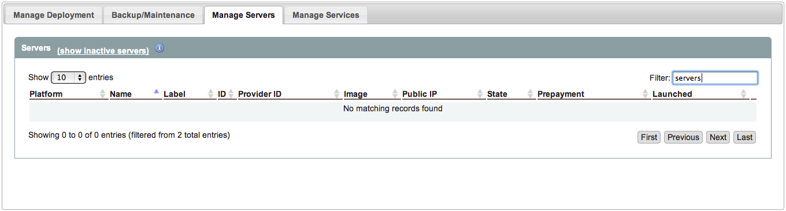

   Tier, Servers

Manage Services, Services
%%%%%%%%%%%%%%%%%%%%%%%%%

From here it is possible to interact with services. To add a service to a tier, first
select the tier from the diagram. Next navigate to the Manage Service tab shown above.
Choose Add Service.

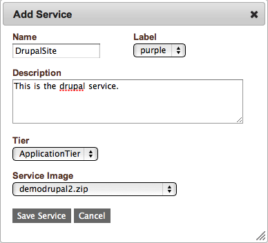

   Tier, Add Service

A list of available services will be presented. Adding a service requires fairly minimal
information. The more interesting part of services is in the configuration.

Selecting this option will present the services that are connected to this tier.

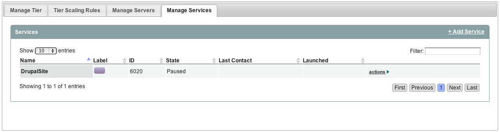

   Tier, Services

Using the same process, a service was also added to the Database tier. To view all
services, select the deployment and choose Manage Services. This will cause the console to
display all of the services installed in all tiers on the deployment.

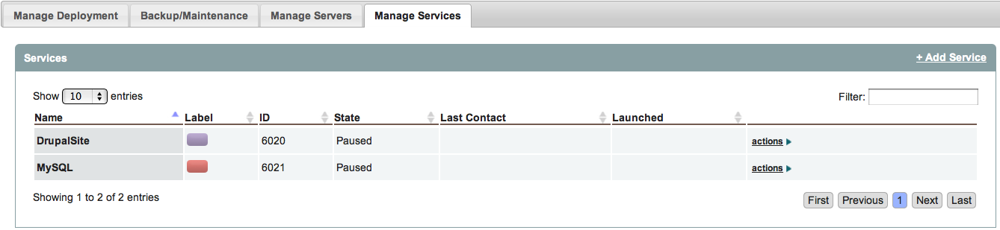

   Tier, All Services

Configuring Services
%%%%%%%%%%%%%%%%%%%%

Configuring services controls options such as the port upon which the services listen for
incoming traffic, credentials, and dependencies. To view the configuration options
associated with a service, click on the green action button for the service:

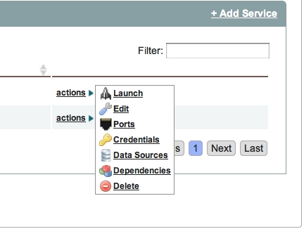

   Service, Actions

Launch
%%%%%%

   Launch is an option that is reserved for starting services on an already running
   deployment. On the service, enStratus will call the script called
   /mnt/services/$serviceID/bin/enstratus-start.

.. note::  If the deployment is not running, this action is meaningless.

Edit
%%%%

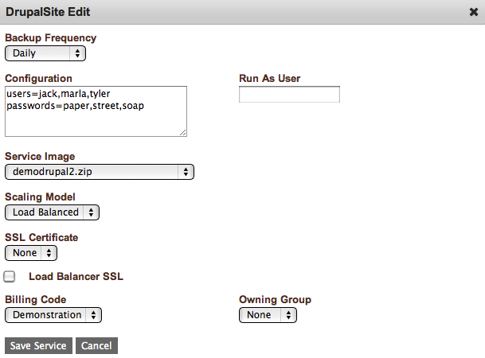

   Service, Edit

Editing a service presents several options. The options presented here control how
enStratus treats your service and what information is passed to your service when changes
occur.

3. **Backup Frequency**

   The backup frequency setting controls the frequency with which enStratus calls any custom
   backup script located in /mnt/services/$serviceID/enstratus/bin/enstratus-backupService.
   This is a service level backup and enStratus will store the resulting backup file in
   cloud storage.

4. **Configuration**

   Configuration is a free form text field that allows an administrator to pass in sensitive
   information to the service. This information makes its way directly into the
   enstratus.cfg file that is passed as an argument to the
   /mnt/services/$serviceID/bin/enstratus-configure as necessary during scaling and starting
   events. Remember that the enstratus.cfg file is securely erased after it is used.

5. Run as User

   The run as user controls the user enStratus will use to start the service.

6. Service Image

   The service image is the service image that will be used for the specified service.
   Service images must first be uploaded via Automation > Service Images.

7. Scaling Model

   The scaling model has four options:

      1. **None** 

         This option means that no special action will be taken during scaling beyond the
         normal scaling mechanism.

      2. **Load Balanced** 

         This option tells enStratus to notify a load balancer when a scaling
         event occurs that affects this service.

      3. **Replicated Database** 

         This option tells enStratus to treat the first server started in a tier as a master
         and all subsequent servers as slaves. Please refer to the MySQL service image for
         more information about this process.

      4. **Clustered Database** 

         This option tells enStratus to treat all database servers as peers with no
         master/slave relationship.

8. SSL Certificate

   SSL Certificates may be uploaded to enStratus via the interface at Infrastructure > SSL.

.. figure:: ./images/sslCertificate.png
   :height: 600px
   :width: 800 px
   :scale: 50 %
   :alt: SSL, Add
   :align: center

   SSL, Add

If a certificate has been uploaded to enStratus, it will be present as an option and
securely passed in to the servers at launch via the /enstratus/bin/configureService script
and ultimately to the user-defined /mnt/services/$serviceID/bin/enstratus-configure script
for use in configuring the service.

In this option, the SSL certificates are passed to the application servers.

7. **Load Balancer SSL**

   Checking this option will allow the administrator to specify the load balancer as a target
   for the SSL certificate. This option is only available for virtual machine based load
   balancers.

   SSL certificates may be available to cloud based load balancers, and must be configured
   via your cloud provider as not all cloud support this option.

8. **Billing Code**

   It is possible to track tier costs against a billing code. Different tiers within the same
   deployment may have different billing codes.

9. **Owning Group**

   The owning group will specify the group attribute for the service.

Ports
%%%%%

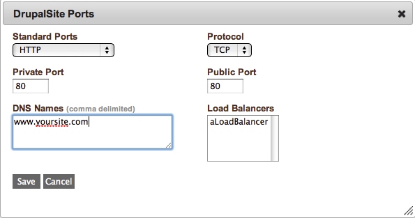

   Service, Ports

Adding a service port to a service will configure enStratus to pass in the relevant port
information to the service via the enstratus.cfg file. If there is a load balancer
connected to the deployment, it will appear in the Load Balancers selection window. If a
load balancer is selected, enStratus will ensure that servers that have this service
installed upon them are connected to the load balancer upon start.

More specifically, if you have virtual machine-based load balancer specified, and an
application server has a service installed that is connected to the load balancer,
enStratus will call /enstratus/bin/startProxy on the load balancer after the service is
configured on the application server.

If a cloud based load balancer such as an elastic load balancer (ELB), enStratus will call
the correct API command to connect that server to the ELB. The cloud based load balancer
must be configured beforehand to pass traffic on the correct ports and protocols.

The relevant section of the enstratus.cfg file for ports is shown here: 

.. code-block:: bash

  [enstratus]
  port.80.protocol=TCP 
  port.80.publicPort=80 
  port.80.privatePort=80 

Credentials are also securely passed to the service via the enstratus.cfg file during
deployment start. What happens to these credentials is determined by the actions taken by
the enstratus-configure script which should be written by the application/service architect.

Credentials
%%%%%%%%%%%

Credentials are also securely passed to the service via the enstratus.cfg file during
deployment start. What happens to these credentials is determined by the actions taken by
the enstratus-configure script which should be written by the application/service
architect.

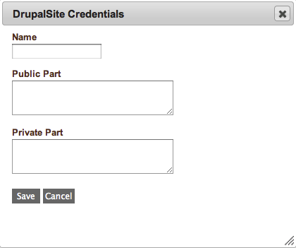

   Service, Credentials

The relevant section of the enstratus.cfg file for credentials is here: 

.. code-block:: bash

  [enstratus]
  serviceKeys=admin 
  serviceKey.admin.user=adminUser
  serviceKey.admin.password=trustno1

This configuration option controls the information that is passed to services via the
enstratus.cfg file. What happens to this information is determined by the actions
specified in the enstratus-configure script written by your application architect.

Data Sources
%%%%%%%%%%%%

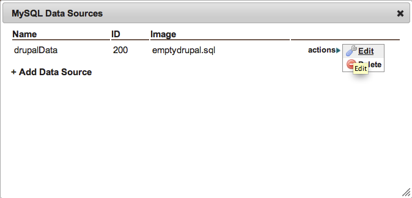

   Service, Data Soruce

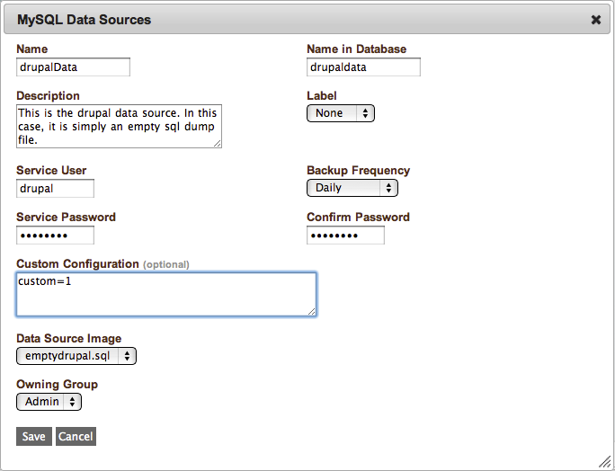

   Data Source, Edit

A data source is tied only to database services. Data sources are database backup files
such as a datasource.sql file that have been uploaded to enStratus for use in deployments
via Automation > Data Sources.

The figure above displays the data source configuration for a MySQL service. The available
configuration options for data sources and their functions are described here:

#. **Name**

   The name is a logical name for the data source as it will appear in the enStratus console.

#. **Name in Database**

   This configuration option ultimately becomes the name of the database itself as in the
   case of a MySQL service.

#. **Description**

   A text description of the service for human reference.

#. **Label**

   An optional color code that will be applied to the service in the enStratus console.

#. **Service User**

   The service user will be the user on the server that owns the service.

#. **Backup Frequency**

   This configuration option specifies the frequency with which enStratus calls the agent
   script called /enstratus/bin/backupService. The function of this script is to call a
   user-configured script called /mnt/services/$serviceID/bin/enstratus-backupDataSource. If
   this script exists, enStratus will execute it and place the resulting file into cloud
   storage. If not, this is a nonoperational event.

#. **Service Password**

   This parameter will become the password that can be used to connect to the data source

#. **Custom Configuration**

   The custom configuration option is a free-form text field that can be used to pass
   information to the enstratus-configure script at the time of service configuration. This
   information will be contained within the enstratus.cfg file.

#. **Data Source Image**

   The data source image is the database dump file that will be used to initialize the
   database named in the Name in Database field.

#. **Owning Group**

   The owning group can be assigned to the service if role based access controls are being
   used.

Dependencies
%%%%%%%%%%%%

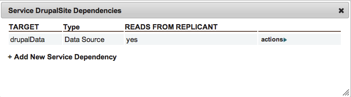

   Service, Dependencies

Creating an dependency means establishing a logical connection between services. For
example, an application service may have a dependency on a database service. Perhaps even
more meaningful than that, an application service may have a dependency on a database data
source.

Operationally, if there exists a dependency between two services, when there are changes
that affect either service such as an auto-recovery or an auto-scaling event, the other
service is notified by enStratus of this environmental change.

This notification process is conducted using the enstratus.cfg file which is passed to all
affected services in a tier.

In the figure above, an application service has a dependency on a data source installed on
a database service. If there is an auto-recovery event on a database server housing the
data source, the application services that depend on it will be notified when enStratus
passes in a new enstratus.cfg file to each of them.

Similarly, when changes such as an auto-recovery or an auto-scaling event occur on servers
housing the application service, the database service will be notified as well to grant or
revoke database access as necessary to compensate for changes at the application tier.
The takeaway message for dependencies is that dependencies establish logical relationships
between services that ensure the required information is passed when environment
changes occur such as a scale or recovery of a server that is running an affected service.

Delete
%%%%%%

Deleting a service will remove it from a tier.

Versioning
%%%%%%%%%%

Maintaining the most recent version of a service is dependent somewhat on the cloud
provider. If your cloud provider has a concept of attachable block storage devices and
your services are installed upon one of them that is regularly being snapshotted, it may
be acceptable to rely on this mechanism for maintaing the most recent software. Update
your services on the running volumes, and the updates will persist once the next snapshot
is taken.

This approach is dependent upon the enStratus auto-recovery and scaling procedures. It is
advisable to also update the service images that are defined for each service in a tier by
uploading a new service image via Infrastructure > Service Images and then pointing the
service definition to the newest version.

If your cloud provider has no concept of attachable block storage devices, the only option
is to take the approach of uploading the new, updated service image via Infrastructure >
Service images and then pointing the service definition to the newest version.

SSL
~~~

SSL certificates may be uploaded to enStratus where they will be protected via the same
encryption methods as any credentials for the customer account. SSL certificates should
not be imaged onto servers, rather, they should be installed in an automated on-demand
fashion at the time of server start.

Creating
%%%%%%%%

Create SSL certificates by any method you desire. enStratus will inform the administrator
via an alert when the SSL cerfiticate is set to expire via a message of the form:

.. literalinclude:: ./files/sslExpire

Uploading
%%%%%%%%%

To upload your certificate to enStratus, navigate to Infrastructure > SSL Certificates as
shown:

.. figure:: ./images/sslCertificate.png
   :height: 500px
   :width: 800 px
   :scale: 50 %
   :alt: SSL, Upload
   :align: center

   SSL, Upload

Updating
%%%%%%%%

To update your SSL certificate, choose an existing certificate from the list and update
the necessary fields, then save.

Using
%%%%%

Data sources are used when configuring a service. More is said about this in the section
on Tiers, which hold services.

Backups
~~~~~~~
Backups occur according the the parameters specified in the Launch Configuration
configuration. As snapshots and occur, they are tracked in the Automation > Backups part
of the enStratus console.

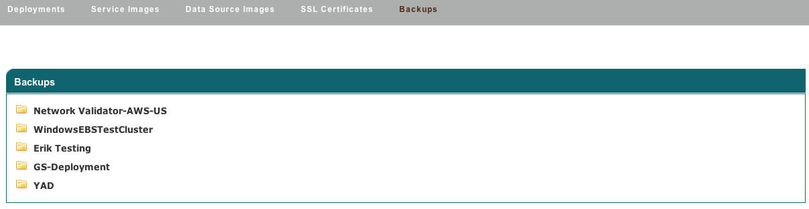

   Deployment Backups
