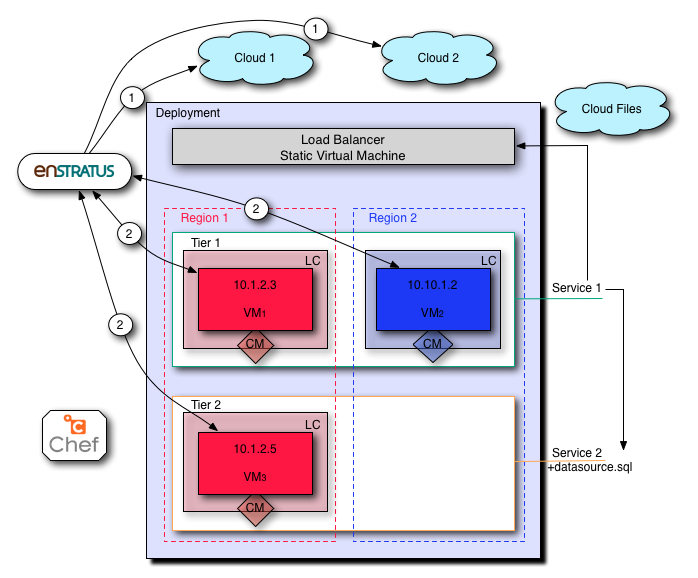
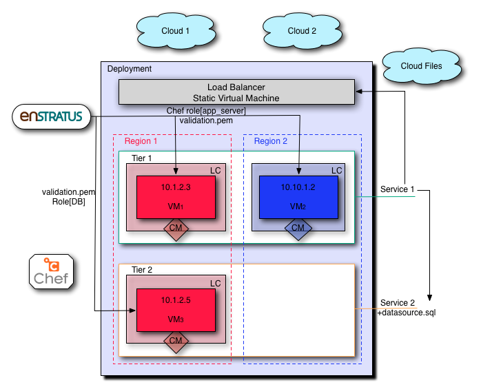
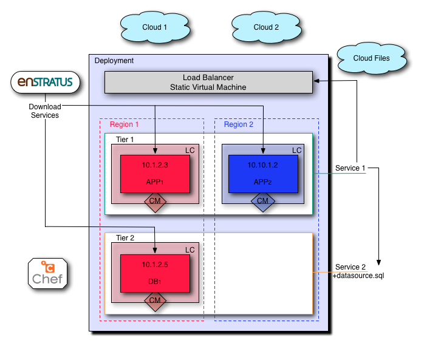
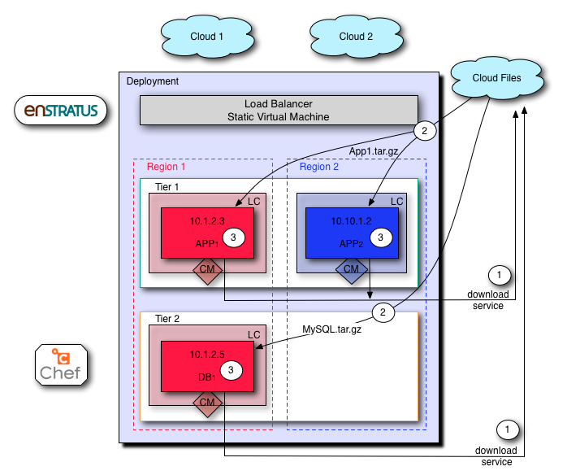
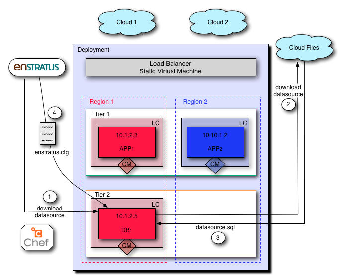

Launch
------
Launching a deployment triggers a series of highly orchestrated and controlled events
leading to a successful deployment and configuration of an application stack.

Starting with the deployment configuration shown below. We'll track the launch of the
deployment from cold start to running.

We'll track the deployment launch by following the enStratus components throughout the
event.

**enStratus**: State/actions of the enStratus management platform.

**Deployment**: State of the deployment. Values will be LAUNCHING, RUNNING.

**Agent**: State of the agent. Script(s) called. Logs to watch.

**Service**: State of the service. Script(s) called.

.. Important:: SaaS users may not have access to view some logs and files that are generated.

**Logs**: Relevant enStratus logs to watch during this step.

**Files**: Files generated by enStratus.

Pre-Launch
^^^^^^^^^^

.. figure:: ./images/Launch0.png
   :height: 900px
   :width: 1000 px
   :scale: 50 %
   :alt: Pre-Launch
   :align: center

   Pre-Launch

.. note:: CM = Configuration Management. Applied at the level of launch configuration.

Launch Initiated/Scale Up
^^^^^^^^^^^^^^^^^^^^^^^^^
During deployment launch, enStratus begins the process of provisioning the infrastructure
needed to support the application architecture.

.. note:: Server launches in an automated "deployment" context are initiated by the
   Scaling worker process, not the dispatcher service as in standalone server launches.

   All deployment server launches are "scaling events". The start of a deployment is a
   scale up from 0 to the minimum number of servers, as specified in the tier.

   Launch Initiated

Component Actions
%%%%%%%%%%%%%%%%%

**Overview**

#. enStratus makes API calls to launch the servers.
#. Once the servers are started, the agents will initiate a handshake.

**enStratus**: Initiate scaling event, launch VM. Register launch event. Change deployment state to LAUNCHING.

**Deployment**: LAUNCHING. This is an informative status change.

**Agent**: STARTING, then RUNNING. 

**Services**:

  * Application: PAUSED
  * Database: PAUSED

**Logs**: 

#. Worker: scaling will launch the VM via the cloud API. 

   Log location: /services/worker/log/

   com.enstratus.automation.worker.ScalingTaskWorker.100.log 

   where 100 is a customer ID, yours may be different

#. Monitor: Server log "discovers" new servers. Deployment log tracks deployment tier
   state. ScalingEvent logs track state of scaling events.

   Log location: /services/monitor/log/

   * Server-1.log
   * Deployment-1.log
   * ScalingEvent-1.log
   * ScalingEventProcess-1.log

#. Dispatcher service: dispatcher log will register the agent handshake.

**Files**: A new scaling worker log will be created if one does not already exist.

.. note:: Expect time from when the launch button is pressed to the generation of a
   scaling event is less than one minute. The expected time of running servers is cloud
   dependent, but should be a few minutes.

Prepare Configuration Management
^^^^^^^^^^^^^^^^^^^^^^^^^^^^^^^^
In this step, enStratus prepares each VM for executing the configuration management run by
passing the necessary credentials/endpoint information to the VM via the enStratus agent.

.. note:: The actions in this step will only take place if there is a configuration
   management action set in the launch configuration.

   Prepare Configuration Management

Component Actions
%%%%%%%%%%%%%%%%%

**enStratus**: Get credentials for the configuration management run from Key/credentials
Management system. Pass them to the VM.

**Deployment**: LAUNCHING

**Agent**: RUNNING. Script called: 

* /enstratus/bin/runConfigurationManagement-CHEF

**Services**:

  * Application: PAUSED
  * Database: PAUSED

**Logs**: 

#. Worker Service: Configuration worker. 

   Log location: /services/worker/log

   com.enstratus.automation.worker.ConfigurationTaskWorker.100.log

**Files**: first-boot.json, validation.pem. These files are passed to the agent script.

Execute Configuration Management
^^^^^^^^^^^^^^^^^^^^^^^^^^^^^^^^
enStratus executes the agent script /enstratus/bin/runConfigurationManagement-CHEF ( in
the case of Chef ) which in turn calls chef-client with first-boot.json as an argument.

.. note:: first-boot.json contains the json for executing the appropriate chef role. For
   example: {"run_list":["role[applicationServer]"]}

   Execute Configuration Management

Component Actions
%%%%%%%%%%%%%%%%%

**enStratus**: Execute the agent script runConfigurationManagement-CHEF.

**Deployment**: LAUNCHING

**Agent**: RUNNING. Script called: runConfigurationManagement-CHEF

**Services**:

  * Application: PAUSED
  * Database: PAUSED

**Logs**: 

#. Worker Service: Configuration worker. Also, the scaling log will still be helpful to
   track.

   Log location: /services/worker/log

   * com.enstratus.automation.worker.ConfigurationTaskWorker.100.log
   * com.enstratus.automation.worker.ScalingTaskWorker.100.log 

#. Agent log.

   Log location: /enstratus/ws/tomcat/log/

   * enStratus console. Server actions menu > Logs
   * catalina.out

**Files**: first-boot.json, validation.pem, client.pem (post-registration)

Service Download/Install
^^^^^^^^^^^^^^^^^^^^^^^^
enStratus downloads the service files from cloud files and installs them to a directory
called /mnt/services/a####, where a#### is the service ID of the service tied to the tier.

This service path is used by enstratus to execute automation events.

All services that are defined for the tier are downloaded to every running VM in the tier.

   Service Download

|

   Service Download

Component Actions
%%%%%%%%%%%%%%%%%

**Overview**

#. enStratus triggers the service download.
#. The enStratus agent download the service files.
#. enStratus executes the agent script called installService, passing the service file.

**enStratus**: Triggers the service download event.

**Deployment**: LAUNCHING

**Agent**: RUNNING. Script called: 

   * /enstratus/bin/installService, once the service is downloaded.

**Services**: 

  * Application: PAUSED
  * Database: STARTING

**Logs**: 

#. Worker Service: Configuration worker. 
#. Agent log. In here there will be information about the download of the service.

   Log location: /enstratus/ws/tomcat/log/ and in the console actions > Logs.
   
   * enStratus console. Server actions menu > Logs
   * catalina.out

**Files**: appService.tar.gz, dbService.tar.gz. 

Configure Dependencies
^^^^^^^^^^^^^^^^^^^^^^
The first part of orchestration, the ordering of deployment events according to the
service dependency relationships, starts here.

The application service depends on the datasource installed as part of the database
service. This means that enStratus will finish configuration on the database service, up
to and including the installation of the datasource, before installing and configuring the
application service.

In this step, the datasource is downloaded from cloudfiles storage and installed on the
database.

   Configure Dependencies

**Overview**

#. Since the datasource installed as part of the database service is the dependency for
   the applicaiton service, it must be configured before any actions can be taken on 
   the application service.
#. enStratus initiates the process for downloading the data source.
#. the enStratus agent downloads the data source file from cloud files storage.
#. enStratus passes in a configuration file to the database server containing information
   about the dependent application VM.

.. important:: This is probably the single most important step to understand in this
  process. 

  Information that cannot be known by the database server *a priori*, such as IP
  addresses, is/are passed to the DB server so it can run a grant statement to allow for a
  connection from a heretofore non-existent application server(s).

  enStratus has knowledge of the entire cloud infrastructure and passes your applications,
  databases, and any service this type of information in a file called enstratus.cfg. The
  information passed to each VM is customizable and extensible.

Component Actions
%%%%%%%%%%%%%%%%%

**enStratus**: Initiates the download of the database datasource file to the database VM,
and passing of configuration files.

**Deployment**: LAUNCHING

**Agent**: RUNNING. 

Scripts called: 

#. installDataSource. Responsible for calling the service script:
   enstratus-installDataSource, which loads the data source into the database.
#. configureService. Responsible for calling the service script: enstratus-configure,
   which reads the configuration file called enstratus.cfg.
#. stopService. Once the configuration is complete, the service is stopped with a call to
   this script, which calls the service script enstratus-stop.
#. startService. After the service is stopped, enStratus start the service using the logic
   provided by calling the service script enstratus-start.

**Services**:

  * Application: PAUSED
  * Database: STARTING

Scripts called:

#. enstratus-installDataSource
#. enstratus-configure. Contains logic to dynamically generate configuration files using
   the information passed to it by enStratus. In this case, the my.cnf file for MySQL is
   generated from the template file that was in cfg/master.cnf. This script is passed the
   above mentioned enstratus.cfg file.
#. enstratus-stop. Contains logic to stop the MySQL service.
#. enstratus-start. Contains logic to start the MySQL service.

**Logs**: 

#. Worker Service: Configuration worker. Scaling Worker.

   Log location: /services/worker/log

   * com.enstratus.automation.worker.ConfigurationTaskWorker.100.log
   * com.enstratus.automation.worker.ScalingTaskWorker.100.log 

#. Agent log. In here there will be information about the download of the datasource and
   the subsequent configuration.

   Log location: /enstratus/ws/tomcat/log/ and in the console actions > Logs.

   * enStratus console. Server actions menu > Logs
   * catalina.out

**Files**: datasource.sql, enstratus.cfg. These files are passed to the database instance.

Configure Dependent Services
^^^^^^^^^^^^^^^^^^^^^^^^^^^^
Now that the database service is configured, the application service dependency is
satisified and the application service can be configured.

enStratus passes a configuration file called enstratus.cfg to the application service
which contains information for the application to dynamically configure the application
configuration files to connect to the database.

Once the application service is deployed and configured, the load balancer is notified of
a new server joining the load-balanced pool. enStratus passes information to the load
balancer so it can take the actions necessary to join the node.

.. figure:: ./images/Launch7.png
   :height: 900px
   :width: 1000 px
   :scale: 50 %
   :alt: Configure Dependent Service(s)
   :align: center

   Configure Dependent Service(s)

Component Actions
%%%%%%%%%%%%%%%%%

**enStratus**: Dependency satisified. Configure application service. Grant database access
to application servers.

**Deployment**: LAUNCHING

**Agent**: RUNNING. 

Scripts called: 

#. configureService. Responsible for calling the service script: enstratus-configure,
   which reads the configuration file called enstratus.cfg.
#. stopService. Once the configuration is complete, the service is stopped with a call to
   this script, which calls the service script enstratus-stop
#. startService. After the service is stopped, enStratus start the service using the logic
   provided by calling the service script enstratus-start.
#. startProxy (Load Balancer, if VM) enStratus passes information about each load-balanced
   node to the load balancer.
#. grantDatabaseAccess. Called on the database server with information about the
   application servers to which access should be granted.

**Services**: 

  * Application: STARTING
  * Database: RUNNING

Scripts called:

#. enstratus-configure. Contains logic to dynamically generate configuration files using
   the information passed to it by enStratus. In this case, the application configuration
   files are generated from the template files in cfg/.
#. enstratus-stop. Contains logic to stop the application service.
#. enstratus-start. Contains logic to start the application service.
#. enstratus-grantDatabaseAccess. Called on the database server.

**Logs**: 

#. Worker Service: Configuration worker. 

   Log location: /services/worker/log

   com.enstratus.automation.worker.ConfigurationTaskWorker.100.log

#. Agent log. Contains information about the configuration of the application service and
   the addition of a load-balanced node.

   Log location: /enstratus/ws/tomcat/log/ and in the console actions > Logs.

   * enStratus console. Server actions menu > Logs
   * catalina.out

**Files**: enstratus.cfg, passed to the application vm.

Start Proxy
^^^^^^^^^^^
In the final step of this deployment launch, the newly provisioned application server
nodes are joined to the load balancing VM.

**enStratus**: Call startProxy on the load balancing VM with information about the
application nodes.

**Deployment**: RUNNING. After this step, the deployment will switch to a RUNNING state.

**Agent**: RUNNING. Script called: /enstratus/bin/startProxy, with arguments necessary to
add the application node to the load balancer software.

**Services**:

  * Application: RUNNING
  * Database: RUNNING

**Logs**: 

#. Agent log on the load balancing VM.

   Log location: /enstratus/ws/tomcat/log/ and in the console actions > Logs.

   * enStratus console. Server actions menu > Logs
   * catalina.out

.. figure:: ./images/Launch8.png
   :height: 900px
   :width: 1000 px
   :scale: 50 %
   :alt: Configure Load Balancing
   :align: center

   Configure Load Balancing

