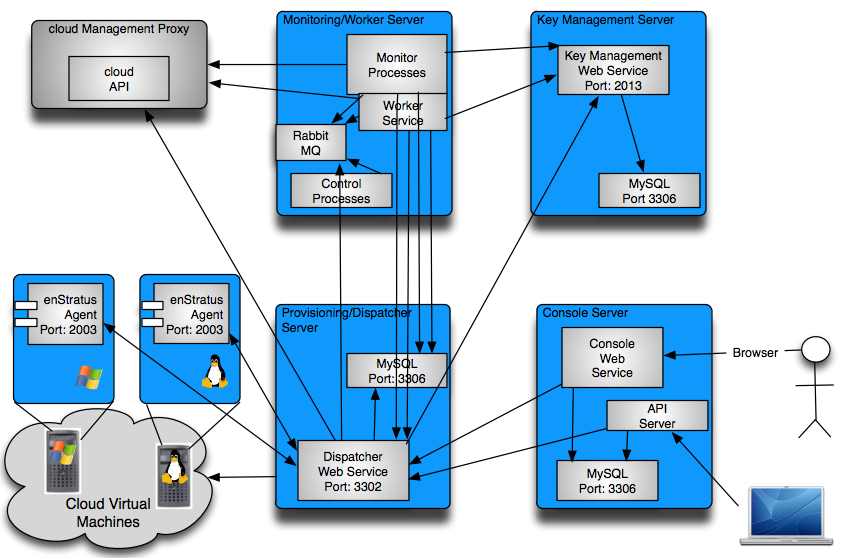

.. _prerequisites:

**************
Pre-requisites
**************

Architecture Requirements
-------------------------

To install enStratus on 4-5 machines
~~~~~~~~~~~~~~~~~~~~~~~~~~~~~~~~~~~~
.. tabularcolumns:: |l|l|l|l|l|
+----------------+---------------+-------------+--------------+----------------------------------+
| Component      | Compute Cores | Memory (Gb) | Storage (Gb) | Software                         |
+================+===============+=============+==============+==================================+
| Key Management | 1             | 1           | 10           | Sun Java JDKv6, MySQL            |
+----------------+---------------+-------------+--------------+----------------------------------+
| Dispatcher     | 2-4           | 4-6         | 20           | Sun Java JDKv6, MySQL, Rabbit MQ |
+----------------+---------------+-------------+--------------+----------------------------------+
| Monitor/Worker | 2-4           | 6-8         | 20           | Sun Java JDKv6, MySQL, JSVC      |
+----------------+---------------+-------------+--------------+----------------------------------+
| Console        | 1-2           | 2-4         | 20           | Sun Java JDKv6                   |
+----------------+---------------+-------------+--------------+----------------------------------+

To install enStratus on 2 machines
~~~~~~~~~~~~~~~~~~~~~~~~~~~~~~~~~~
.. tabularcolumns:: |l|l|l|l|l|
+----------------+---------------+-------------+--------------+----------------------------------------+
| Component      | Compute Cores | Memory (Gb) | Storage (Gb) | Software                               |
+================+===============+=============+==============+========================================+
| Backend        | 4-6           | 6-12        | 30           | Sun Java JDKv6, MySQL, Rabbit MQ, JSVC |
+----------------+---------------+-------------+--------------+----------------------------------------+
| Console        | 4-6           | 6-12        | 30           | Sun Java JDKv6, MySQL                  |
+----------------+---------------+-------------+--------------+----------------------------------------+

.. Note:: In the case of the 2-server model, the KM, Dispatcher, Monitor, and Worker services will be installed on one machine. 

To install enStratus on a single machine
~~~~~~~~~~~~~~~~~~~~~~~~~~~~~~~~~~~~~~~~
.. tabularcolumns:: |l|l|l|l|l|
+----------------+---------------+-------------+--------------+----------------------------------------+
| Component      | Compute Cores | Memory (Gb) | Storage (Gb) | Software                               |
+================+===============+=============+==============+========================================+
| Everything     | 6-24          | 6-12        | 30           | Sun Java JDKv6, MySQL, Rabbit MQ, JSVC |
+----------------+---------------+-------------+--------------+----------------------------------------+

.. Warning:: Installing with the bare minimum requirements may result in a degradation of performance.

Networking Requirements
-----------------------
enStratus components must have direct communications with each other. To enable enStratus agent communication
on the guest VM, please make the following considerations:

Dispatcher Service 
~~~~~~~~~~~~~~~~~~

The dispatcher service listens on port 3302. Provisioned (guest) virtual machines that have the agent
installed upon them must be able to reach the dispatcher service on this port.

Agent
~~~~~
The enStratus agent listens on port 2003 and can be installed on guest virtual machines. The server(s) upon
which the dispatcher and workers service runs must be able to communicate to the agent on this port.

To summarize:

* Communication from guest virtual machines to the dispatcher server on port 3302

* Communication from the dispatcher service to the guest virtual machines on port 2003

Other Information
~~~~~~~~~~~~~~~~~

Required operating system is Linux. Architecture x86_64. Preferred distribution is
Ubuntu/Debian. While nothing technologically prevents a windows installation,
I'll leave that as an exercise for the reader. :)

The server onto which enStratus is installed can be virtual. They should not, however, be part of the pool of
VMs enStratus is destined to manage.

All machines must have direct, non-vpn network access to each other.

Provisioned/managed VMs must have direct, non-proxied, non-vpn access to the dispatcher and worker servers.

If an enStratus engineer is performing the installation, we will require shell access with root privileges to
all of the machines onto which enStratus is to be installed.  

enStratus engineers can provide their public SSH key to you for remote access or they can work through a VPN.
We require port 22, 80, and 443 access externally to our office IP address: 216.250.165.28.

Requesting installations over a "screenshared" session such as webex is *strongly* discouraged. It is highly
inefficient and greatly increases the possibility of error.

The enStratus software installation process is most suited to a systems administrator with knowledge of how to
install the prerequisites and do basic configuration.

The file (object) storage server will be used for object (file) storage as is essential to do things like
automation and downloading of service images and scripts to running virtual machines. 

enStratus engineers will also assist on-premise clients with the installation
and configuration of the enStratus agent, a pre-requisite for doing automation.

enStratus Communications
------------------------
The purpose of this section is to clarify the communication channels required by the individual enStratus
components. Ports listed are default and/or standard service ports and are subject to any customizations made
by the installing engineers.

Example
~~~~~~~
Let's assume that the enStratus installation is using the 4-server model shown above. The worker and
dispatcher servers and their associated services can be moved as necessary to a separate network provided the
communication paths between remain. This principle holds for any of the enstratus components.

enStratus has a very flexible architecture. If you are an administrator of the enStratus software, you should
feel free to move components and architect the most appropriate solution for your cloud environment.

enStratus Internal/External Communications
~~~~~~~~~~~~~~~~~~~~~~~~~~~~~~~~~~~~~~~~~~

.. tabularcolumns:: |l|l|p{5cm}|p{5cm}|

+--------------------+-----------------+----------------------------------------------------+---------------------------------------------------------------+
| Component          | Listens IP:Port | Accepts From                                       | Initiates To                                                  | 
+====================+=================+====================================================+===============================================================+
| Console            | $IP:80, $IP:443 | Internet (or equivalent), API, LDAP/AD             | LDAP/AD, Dispatcher, Console (MySQL)                          |
+--------------------+-----------------+----------------------------------------------------+---------------------------------------------------------------+
| Console (MySQL)    | $IP:3306        | Console Service, API, LDAP/AD                      | N/A                                                           |
+--------------------+-----------------+----------------------------------------------------+---------------------------------------------------------------+
| KM                 | $IP:2013        | Dispatcher, Worker, Monitor                        | KM (MySQL)                                                    |
+--------------------+-----------------+----------------------------------------------------+---------------------------------------------------------------+
| Dispatcher         | $IP:3302        | Internet (guest vm), API, Monitor, Worker, Console | Dispatcher (MySQL), Rabbit MQ, KM, Monitor, Worker, Cloud API |
+--------------------+-----------------+----------------------------------------------------+---------------------------------------------------------------+
| Dispatcher (MySQL) | $IP:3306        | Dispatcher, Monitor, Worker                        | N/A                                                           |
+--------------------+-----------------+----------------------------------------------------+---------------------------------------------------------------+
| Monitor/Worker     | N/A             | N/A                                                | Cloud API, Dispatcher, Dispatcher MySQL, Rabbit MQ, KM        |
+--------------------+-----------------+----------------------------------------------------+---------------------------------------------------------------+
| Rabbit MQ          | $IP:5672        | Dispatcher, Monitor, Worker                        | N/A                                                           |
+--------------------+-----------------+----------------------------------------------------+---------------------------------------------------------------+
| API                | $IP:15000       | Internet (or equivalent)                           | Dispatcher, Console MySQL                                     |
+--------------------+-----------------+----------------------------------------------------+---------------------------------------------------------------+

|
