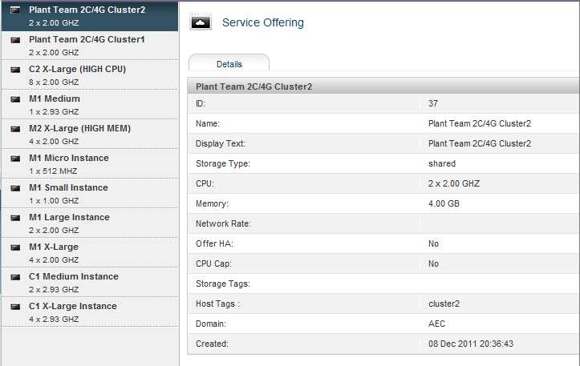
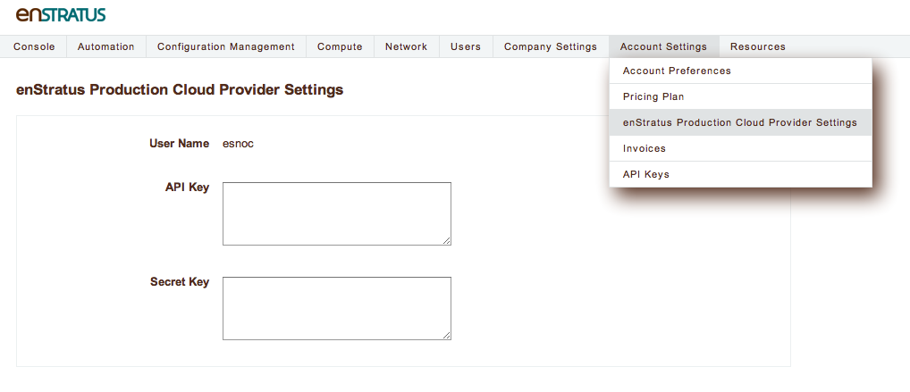

Customizing cloud cost accounting
---------------------------------

Overview
~~~~~~~~
enStratus allows you to enter customized cost-tracking information for any cloud. To
accomplish this, you will need the following information:

#. The product offerings list of your cloud. This is the list of products that your cloud provider offers. For example: m1.small in a eucalyptus environment.
#. If your cloud supports volumes (block storage), you will need to determine a price you wish to charge for them.

Cost Granularity
~~~~~~~~~~~~~~~~
.. tabularcolumns:: |l|l|l|
+-----------------+------------------------------+-----------+
| Resource        | Database Table               | Frequency |
+=================+==============================+===========+
| Servers         | provisioning.server_product  | hour      |
+-----------------+------------------------------+-----------+
| Volumes         | provisioning.volume_product  | hour      |
+-----------------+------------------------------+-----------+
| Storage (files) | provisioning.storage_product | hour      |
+-----------------+------------------------------+-----------+

For server/instance resources, enStratus tracks costs by matching a product offering
identifier located in the server_product table to a product offering made by a dynamic
call to the cloud provider.

As an example, the list of product offerings from a CloudStack cloud may look like this:

.. code-block:: mysql

  +----+-------------------+--------------------------+----------+ 
  | id | name              | display_text       | cpu | ram_size | 
  +----+-------------------+--------------------------+----------+ 
  | 22 | M1 Micro Instance | 1x512Mhz 768MB RAM | 1   | 768      | 
  | 23 | M1 Small Instance | 1x1.0GHz, 2GB RAM  | 1   | 2048     | 
  | 24 | M1 Large Instance | 2x2.0GHz, 4GB RAM  | 2   | 4096     | 
  +----+-------------------+--------------------------+----------+ 

   CloudStack Service Offerings

With this information, we're ready to start crafting entries for tracking server costs.

Adding Server Product Costs
~~~~~~~~~~~~~~~~~~~~~~~~~~~
The general form of a server_product table is shown here:

The big picture here is that enStratus is looking for a match to the provisioned server in
the product offerings given to us by the cloud provider.

So, for example, if you start an M1 medium server, enstratus will check to see if there is
a match to the "product size".

.. code-block:: none

  +---------------------------+------------------------------------------------------------------------------+
  | Field                     | Meaning                                                                      |
  +---------------------------+------------------------------------------------------------------------------+
  | server_product_id         | Unique value                                                                 |
  | cloud_id                  | Must match the cloud_id for the cloud in the provisioning.cloud table        |
  | product_size              | Must match the id field for the service offering                             | 
  | active                    | Set to 'Y' if the product is active                                          |
  | architecture              | I32 or I64                                                                   |
  | core_count                | Number of cores assigned to the product                                      |
  | cpu_power                 | Integer value such as 1000 for a 1GHz resource                               |
  | description               | Some appropriate description                                                 |
  | disk_in_gb                | Size of disk offering (Gb)                                                   |
  | memory_in_gb              | Memory allocation (Gb)                                                       |
  | name                      | Name of the offering                                                         |
  | platform                  | Can be WINDOWS, UNIX, etc.                                                   |
  | prepayment_term_in_months | Set to 0, by default                                                         |
  | provider_region_id        | Must match the region of the cloud in the provisioning.provider_region table |
  | software                  | Must be set to '', not NULL, for now.                                        |
  | standard_pricing_currency | Example: USD, GBP                                                            |
  | standard_pricing_hourly   | Value for tracking cost. Example 0.10.                                       |
  | standard_pricing_prepaid  | Set to 0, by default                                                         |
  +---------------------------+------------------------------------------------------------------------------+

We can now begin to create entries in the server_product table. Using the first value shown in the CloudStack offerings above:

.. code-block:: none

  +---------------------------+---------------------------------------+------+
  | Field                     | Value                                 | Note |
  +---------------------------+---------------------------------------+------+
  | server_product_id         | 1                                     |      |
  | cloud_id                  | 10001 (from the cloud table)          | 1    |
  | product_size              | 22 (from the CloudStack value above)  | 3    |
  | active                    | Y                                     |      |                
  | architecture              | I64 (admin must know this value)      |      |
  | core_count                | 1                                     |      |
  | cpu_power                 | 512                                   |      |
  | description               | 1x512Mhz 768MB RAM                    |      |
  | disk_in_gb                | 20                                    |      |
  | memory_in_gb              | 0.75                                  |      |
  | name                      | M1 Micro Instance                     |      |
  | platform                  | UNKNOWN                               |      |
  | prepayment_term_in_months | 0                                     |      |
  | provider_region_id        | 1 (from provisioning.provider_region) | 2    |
  | software                  | '' (set to a blank string, not null)  |      |
  | standard_pricing_currency | USD                                   |      |
  | standard_pricing_hourly   | 0.14 (For 14 cents/hour)              |      |
  | standard_pricing_prepaid  | 0                                     |      |
  +---------------------------+---------------------------------------+------+

And, as an insert statement:

.. code-block:: mysql 

  INSERT INTO server_product VALUES (1,10001,'22','Y','I64',1,512,'1 x 512Mhz, 768MB RAM',2,4,'M1 Micro Instance','UNKNOWN',0,'1','','USD',0.14,0);

Repeat this process for every cloud product offering.

**Notes**

1. To get your cloud_id, first, navigate inside the console to Account Settings > $YOUR_CLOUD Provider Settings. $YOUR_CLOUD is your cloud name, we're going to use that to find the cloud_id. In the figure below, the cloud name is enStratus Production Cloud.

   Finding the Cloud Name

With this information, you can issue the following query against the provisioning.cloud table:

.. code-block:: mysql
  
  select cloud_id from cloud where name like 'enStratus Production Cloud%';

  +----------+
  | cloud_id |
  +----------+
  | 20013    |
  +----------+

There should only ever be one line of output from this query. If you get more than one result, narrow your query.

2. To find the provider_region_id, issue the query:

.. code-block:: mysql

  select provider_region_id from provider_region where cloud_id=20013;

 +--------------------+
 | provider_region_id |
 +--------------------+
 | 1                  |
 +--------------------+

3. Finding the product offerings for your cloud provider. The most reliable method for obtaining information is to ask your cloud administrator.

And, as an insert statement:

.. code-block:: mysql 

  INSERT INTO server_product VALUES (1,10001,'22','Y','I64',1,512,'1 x 512Mhz, 768MB RAM',2,4,'M1 Micro Instance','UNKNOWN',0,'1','','USD',0.14,0);

Repeat this process for every cloud product offering.

Adding Volume Product Costs
~~~~~~~~~~~~~~~~~~~~~~~~~~~
The process for adding volume costs is less involved. enStratus tracks volume costs via the volume_product table in the provisioning database.

.. code-block:: none

  +--------------------+---------------------------------------------------+
  | Field              | Meaning                                           |
  +--------------------+---------------------------------------------------+
  | volume_product_id  | Unique identifier                                 |
  | cloud_id           | Cloud ID from provisioning.cloud table            |
  | provider_region_id | Region ID from provisioning.provider_region table |
  | product_size       | Set to standard                                   |
  | active             | Set to 'Y'                                        |
  | currency           | Currency type. Example: USD                       |
  | name               | Example: 'Block storage for my cloud.'            |
  | description        | Meaningful description here.                      |
  | pricing_threshold  | Set to 0                                          |
  | volume_pricing     | Price, per hour, for the storage. Example: 0.10   |
  +--------------------+---------------------------------------------------+

As an insert statement (example from Amazon)

.. code-block:: mysql 

  INSERT INTO volume_product VALUES (1,1,'us-east-1','standard','Y','USD','EBS Storage','Storage costs for an allocated EBS volume.',0,0.1);

Other Currencies
~~~~~~~~~~~~~~~~
One of the strengths of enStratus customized cost tracking is that it can track costs in
many currencies. For example, to track the costs of server product against the Indian
Rupee, use INR as the value for standard pricing currency.  

If you choose to track in a currency other than USD, enStratus will try to reach out to
the Internet to pull exchange rates. This is not always feasible. To override this, set
your own exchange rate in the exchange rate table, as shown:

.. code-block:: mysql 

  mysql> select * from exchange_rate;
  +--------------------+----------+----------+---------+
  | exchange_rate_code | customer | currency | rate    |
  +--------------------+----------+----------+---------+
  | 200:USD            | 200      | USD      | 0.01927 |
  +--------------------+----------+----------+---------+

Where 200 is your enStratus customer ID. If tracking costs in a currency other than USD is
a priority, please contact an enStratus engineer for assistance finding your customer ID.

**Checking to see if it worked**

To see if the products are matching servers, navigate to the Compute > Servers page and
click on the actions menu for a server. Choose the Product tab. If the costs are tracking
correctly, you will see output similar to the image below.
