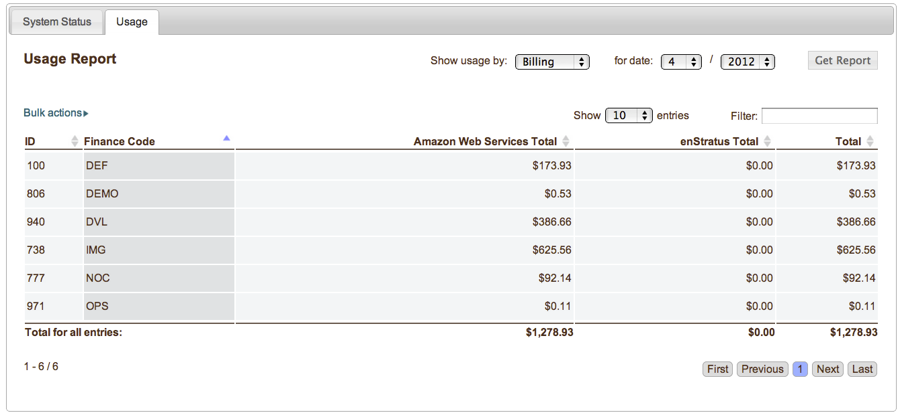
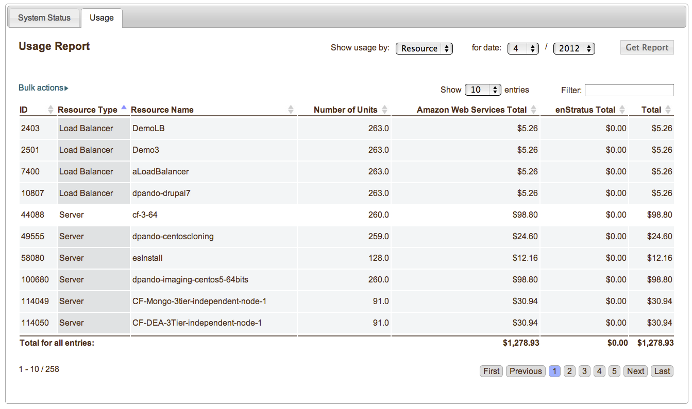
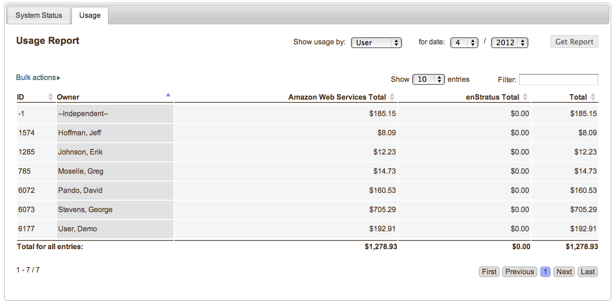
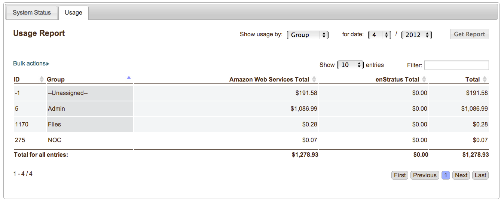

.. Reports
レポート
-------
.. Using the enStratus console, it is also possible to view detailed reports of your account.
enStratusコンソールを使用して、あなたのアカウントの詳細なレポートを表示することも可能です。

.. For an even more granular view of how resources are being used in the account, navigate to
   Console > Reports. Several options are presented in a tabbed interface. Choose the tab
   labeled usage.
アカウントでリソースがどように使用されているかのより詳細なビューについては、 Console > Reports に移動
します。いくつかのオプションがタブ付きインターフェイスで表示されます。
使用量のラベルのついたタブを選択してください。

   Budget View

.. Using the reports tab, information relating to billing and charges can be sorted by
   billing code, resource, user, and group. Use the drop down box selector for Show Usage By:
   to choose the preferred method for displaying data.
[レポート]タブを使用して、課金および料金に関する情報を、課金コード、リソース、ユーザー、
およびグループで並べ替えることができます。
[使用量]の表示にはドロップダウンボックスのセレクタを使用して[好みのデータ表示方法を選択するには]を選択します。

.. Use the date selector drop down options to look back to previous months usage. 
ドロップダウンオプションの日付セレクタを使用して前月の使用量に戻ります。

.. Billing Code
課金コード
~~~~~~~~~~~~

.. Displaying usage by billing code will display the costs associated with each billing code
   for which there is information. This view is similar to the information presented when
   viewing
課金コードによって使用量を表示すると、情報がある各課金コードに関連付けられたコストが表示されます。
このビューは、"viewing" で提示された情報に似ています。

.. Infrastructure > Budget Codes. In this view, however, costs are segregated into two main
   categories. First, the costs for usage based on the price charged by the cloud provider.
   Second, the costs charged by enStratus. 
このビューでは Infrastructure > Budget Codes が表示されています。しかし、コストは、主に2つの
カテゴリに区分されています。まず最初に、クラウドプロバイダによる課金価格に基づいた使用量のコストです。
２番目に、enStratusに課金されたコストです。

.. Resource
リソース
~~~~~~~~

.. To view charges associated with cloud resources such as servers and load balancers, select
   Show Usage By: Resource from the option list and click Get Report.
サーバやロードバランサなどのクラウドリソースに関連付けられた料金を表示するには、
[オプションリストからのリソース]による[使用量]の表示を選択、[レポートを取得]をクリックします。

   Resource View

.. As usual, the columns are sortable and the entire list is able to be filtered using the
   filter text box. 
いつものように、カラムはソート可能であり、全体のリストは、フィルタテキストボックスを使用して
フィルタ処理することができます。

.. User
ユーザー
~~~~

.. To view charges by user, select Show Usage By: User, and click Get Report.
ユーザーによる料金を表示するには、使用状況を表示する]を選択します：ユーザー、およびレポートの取得]をクリックします。

   User View

.. Group
グループ
~~~~~

.. Finally, to view usage by group. Select Show Usage By: Group, and click Get Report.
最後に、グループでの使用量を表示します。
[グループ]による[使用量]の表示を選択し、およびレポートの取得]をクリックします。

   Group View
