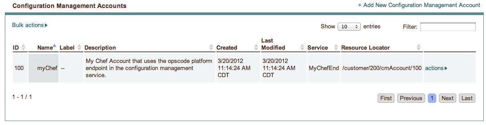
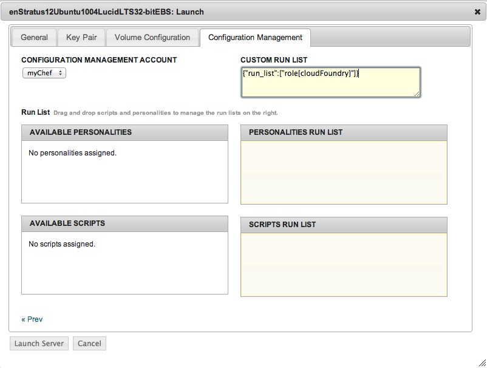
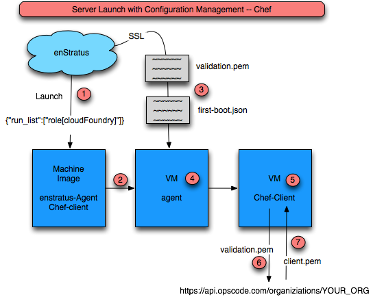

Using Chef
----------

Getting Started
^^^^^^^^^^^^^^^
Using Chef to configure instances requires the following software be installed:

1. enStratus agent.

   Although Chef can be used to install the enStratus agent, in an automation enviroment
   where Chef is used to configure instances at run-time, the agent is used as a trigger
   point so that chef runs happen at the appropriate time and with the appropriate
   credentials.

.. note:: Although the requirement for the enStratus agent seems like an unreasonable
   request at first, it actually allows for a great degree of flexibility in executing Chef
   client calls against Chef endpoints. 

.. note:: enStratus passes in a chef-endpoint, and the credentials for connecting to
   that endpoint at runtime to the instance via the agent. The agent dynamically writes
   the client.rb file with this information, making the image usable anywhere.

.. note:: 

   **Use Case** 

   enStratus engineers frequently do Chef server installations at client sites
   for POC. Often, the Chef server is a VM just like any other instance, and as such has all
   the ephemerality of instances running on a POC cloud project.
 
   enStratus solves the problem of moving Chef server targets by abstracting that process and
   using the agent to handle the passing of necessary information to each instance.

   In summary, the standing up of Chef-enabled instances becomes trivial. Just install
   the Chef client with a templated client.rb (shown below) and let the agent kick off the
   Chef execution.

2. Chef-client.
 
   The chef-client software is used to execute the Chef run.

Add a Configuration Management Service
^^^^^^^^^^^^^^^^^^^^^^^^^^^^^^^^^^^^^^

Location: Configuration Management > Services

Create a new configuration management service of type Chef.

.. figure:: ./images/chefService.png
   :height: 400px
   :width: 500 px
   :scale: 95 %
   :alt: Add Configuration Management Service
   :align: center

   Add Configuration Management Service

**Service Added**

.. figure:: ./images/chefService2.png
   :height: 400px
   :width: 1500 px
   :scale: 65 %
   :alt: Add Configuration Management Service
   :align: center

   Configuration Management Service Added

Add a Configuration Management Account
^^^^^^^^^^^^^^^^^^^^^^^^^^^^^^^^^^^^^^
Location: Configuration Management > Accounts

.. figure:: ./images/chefAccount.png
   :height: 500px
   :width: 600 px
   :scale: 95 %
   :alt: Add Configuration Management Account
   :align: center

   Add Configuration Management Account 

**Account Added**

   Configuration Management Account Added

Configure an Image to use Chef
^^^^^^^^^^^^^^^^^^^^^^^^^^^^^^

#. Install the enStratus Agent.
#. Install the chef client.
#. Edit /etc/chef/client.rb (make it a "template" that the enStratus agent will re-write)

Launch VM with Configuration Management Action
^^^^^^^^^^^^^^^^^^^^^^^^^^^^^^^^^^^^^^^^^^^^^^
To trigger a vm launch and and accompanying chef action, launch a vm and choose the
appropriate configuration management engine. For Chef, use the text window to paste in
json that will be passed to the chef-client call as shown.

Here, we're passing in a chef role.

   Launch VM with Configuration Management Action

The process for launching a vm with a subsequent chef-client call is shown below.

   Launching a VM with a chef-client call

#. A launch event is triggered using the Configuration Management tab with a run list.
#. The VM must have the chef-client pre-installed and the enStratus agent pre-installed.
#. enStratus will pass to the VM agent script:

   * validation.pem
   * first-boot.json

4. The agent script dynamically replaces the template variables in client.rb and copies the validation.pem to /etc/chef

5. The agent triggers a chef-client call with the first-boot.json file as an argument

6. Triggering a validation run for the client

7. The client.pem file is returned and the chef run completes.

.. note:: At first, it might seem like the dynamic re-writing of the client.rb variables
  is a hindrance to smooth operations, however, it makes images very portable should the
  chef endpoint change.

Agent Script: runConfigurationManagement-CHEF
+++++++++++++++++++++++++++++++++++++++++++++
This file is part of an agent installation and is located in the /enstratus/bin directory.
enStratus passes the validation.pem file along with some json used to execute the
chef-client procedure shown below.

The agent script replaces the dummy variables in the client.rb and then it executes a
chef-client call:

.. code-block:: bash
  
   sudo chef-client -j $FIRST_BOOT

Where $FIRST_BOOT is a file with the contents specified via the enstratus console as json
file for the chef client call. In the example below:

.. code-block:: json

  {"run_list":["role[cloudFoundry]"]}

**Agent Script: /enstratus/bin/runConfigurationManagement-CHEF**

.. literalinclude:: ./files/runConfigurationManagement-CHEF
   :language: bash
   :emphasize-lines: 26,29,35
   :linenos:

#. Line 26: Rewrites the chef endpoint.
#. Line 29: Rewrites the validator.
#. Line 35: Executes the chef call.

client.rb
+++++++++

**Client.rb: /etc/chef/client.rb**

.. literalinclude:: ./files/client.rb
   :language: ruby
   :emphasize-lines: 8,22
   :linenos:
