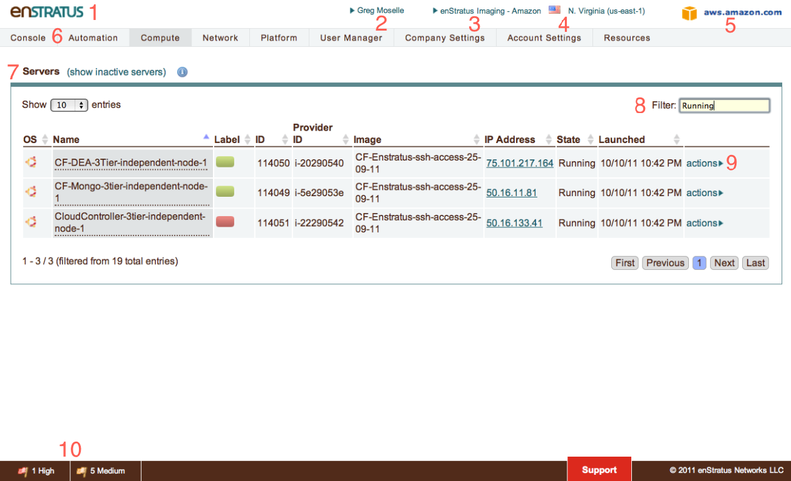
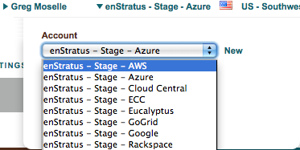
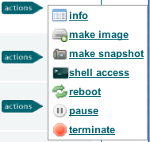
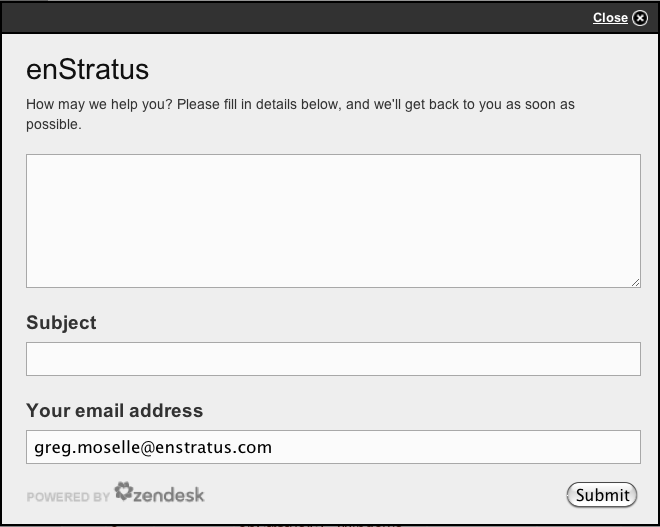

Console
=======

Purpose
-------

The purpose of this section is to familiarize the user with the enStratus web front end,
referred to as the enStratus console. Upon completing this objective, the user should be
able to identify the major components of the console, as well as feel comfortable
navigating and accomplishing small tasks.'

The enStratus console can be divided into several functional areas. In this section, we
will cover each of the following functional areas at a high level.

   UI Overview

.. code-block:: none

  +-------+--------------------------+
  | Field | Meaning                  |
  +-------+--------------------------+
  | 1     | Customer Brand           |
  | 2     | User/Profile             |
  | 3     | Account                  |
  | 4     | Region                   |
  | 5     | Cloud                    |
  | 6     | Navigation Menu          |
  | 7     | Content Pane             |
  | 8     | Filter                   |
  | 9     | Action Menu              |
  | 10    | Staus/Alert/Support Menu |
  +----------------------------------+

Console Overview
----------------

The customer brand can be used to depict the unique logo for a custom deployment of
enStratus.

User Profile
~~~~~~~~~~~~
.. figure:: ./images/userProfile.png
   :height: 100px
   :width: 300 px
   :scale: 95 %
   :alt: User Profile
   :align: center

   User Profile

The name of the person currently logged in to the enStratus console. Clicking on this link
provides functionality for editing user profile or for changing the user's password.

Account
~~~~~~~

   Account

enStratus can access many accounts in one cloud provider or accounts in separate clouds
simultaneously. Clicking on the account will activate a menu for selecting an account. The
functionality displayed within the enStratus console is shown in figure at right.

Region
~~~~~~
If the underlying cloud provider has the concept of regions, those regions will be
displayed and be selectable from here. After entering your cloud credentials, these
regions will auto-populate as enStratus begins to discover the attributes of the cloud
provider.

Cloud
~~~~~
Logo of the cloud provider. When navigating between different cloud providers, this logo
will change to reflect the selected cloud.

Navigation Menu
~~~~~~~~~~~~~~~
The navigation bar displays the first level of interaction with the cloud provider.

Content Pane
~~~~~~~~~~~~
The main content window for interacting with cloud resources is the content pane. The
content displayed in this main window depend on the selections made in the Primary and
Secondary navigation panes. For example, if Infrastructure > Servers is selected, all
active servers will be displayed in the content pane.

Filter
~~~~~~
The filter text box allows for dynamic filtering of content presented in the content pane.

Actions Menu
~~~~~~~~~~~~

   Actions Menu

The green action menu is a standard enStratus convention for activating a sub menu of
options specific to a particular piece of cloud infrastructure. The sub menu, shown below,
is activated by clicking on the actions button.

The action button menu shown here is for a cloud server. Note: Some options shown in this
image are only available after the enStratus agent has been installed on the virtual
machine.

If the cloud administrator for your account has implemented groups and roles, the action
button may or may not be present in all cases. Presenting or hiding the green action
button is one method enStratus uses to enforce role based access controls for cloud
infrastructure.

The action button is available for many different aspects of cloud infrastructure. The sub
menu is meant to be intuitive easy to use.

Status/Alert/Support Menu
~~~~~~~~~~~~~~~~~~~~~~~~~
.. figure:: ./images/alertsSlide.png
   :height: 100px
   :width: 300 px
   :scale: 95 %
   :alt: Alerts
   :align: center

   Alerts

The status menu is located at the bottom of the content pane. If there are any alerts in
any of the accounts of which you are a part, they will be displayed here. Alerts are
categorized High, Medium, or Low. Clicking on an alert color will slide out a truncated
list of alerts, which are accessible by clicking.

Options for interacting with alerts include clicking on them to view in more detail or
deleting them.

The support link provided at the bottom of the console provides an integration point for
external help desk functionality such as Zendesk. In the SaaS offering for enStratus,
clicking the support link will activate a dialog window for sending a support request to
the enStratus team.

   Submit Ticket

.. include:: alert.rst
