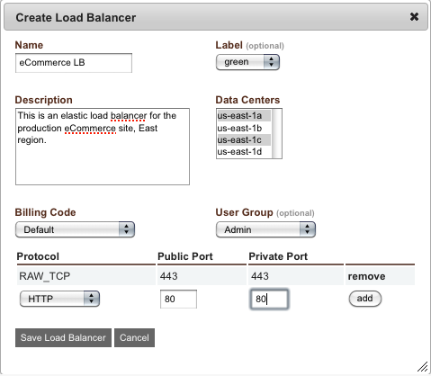

.. Load Balancers
ロード·バランサ
--------------
.. Successful application load balancing involves dynamically adding and removing application
   nodes from the load balanced pool. This discussion is limited to addressing the activity
   that takes place on the load balancer.
成功したアプリケーションのロードバランシングは負荷分散プールにアプリケーションノードを動的に
追加したり、そこから削除することを含みます。この議論は、ロードバランサ上の動作にのみ関心を制限します。

.. Overview
概要
~~~~~~~~
.. enStratus supports a wide range of load balancers. In the Amazon Cloud, Elastic Load
   Balancers are available for provisioning and use from within enStratus. Server-based load
   balancers can be started for use or an existing server can be purposed as a load balancer
   via HA-Proxy or ajp (mod_jk). Finally, third party load balancing solutions are available
   in the form of the Zeus load balancer.
enStratusは、広い範囲のロードバランサをサポートしています。Amazonのクラウドでは、 Elastic Load Balancers を
、enStratus内からプロビジョニングして利用可能です。サーバベースのロードバランサを使用するために開始する
ことができ、または既存のサーバーをHA-ProxyまたはAJP（mod_jk）経由でロードバランサとして利用する
ことができます。最後に、サードパーティ製の負荷分散ソリューションが Zeus load balancer の形態で利用可能です。

Elastic Load Balancer
~~~~~~~~~~~~~~~~~~~~~
.. Elastic load balancers are an offering from Amazon Web Services that are well supported in
   enStratus. ELB are advantagous because they can be cheaper to operate than server based
   solutions. The configuration requirements for ELB is often simpler than using server-based
   load balancing.
Elastic Load Balancer は、Amazon Webサービスからのオファリングで、enStratusでも良くサポートされています。
ELBはサーバーベースのソリューションより安く動作できますので、有利です。
ELBの構成要件は、多くの場合、サーバーベースのロード·バランシングを使用するよりも簡単です。

.. To provision a new elastic load balancer using enStratus, navigate to Infrastructure, Load
   Balancers. Select + create_load_balancer. A single dialog box will present the required
   configuration options for the load balancer.
enStratusを使用して、新規の elastic load balancer をプロビジョンするには、インフラストラクチャに移動し、ロード
バランサに移動します。 + create_load_balancerを選択します。１つのダイアログボックスがロードバランサ必要な構成
オプションを提示します。

   Create ELB

.. ELB Discussion
ELBディスカッション
~~~~~~~~~~~~~~
.. The Name, Label, and Description fields should be self-explanatory. More care should be
   taken when configuring the Data Center portion of the dialog. Each configured data center
   will receive an equal portion of the traffic entering the load balancer. This means that
   for each data center configured, there should be a "listening" application server to field
   the load balanced traffic.
名前、ラベル、および説明フィールドが自明でなければなりません。ダイアログボックスのデータセンターの部分を
構成するときにはより多くのケアがなければならないことに注意。それぞれの構成されたデータセンターは
ロードバランサに入るトラフィックの等しい部分を受け取ることになります。これは、設定されている
各データセンターでは、負荷分散されたトラフィックをてきぱき処理する "listening" アプリケーション
サーバーがあるはずという意味です。

.. For example, let's assume we have a load balancer configured for data centers us-east-1a
   and us-east-1b. This means that 50% of the inbound traffic that reaches the load balancer
   will be sent to associated servers in east-1a and 50% of the inbound traffic will be sent
   to servers in east-1b. If no servers are provisioned in a data center, the traffic will
   manifest as an error.
たとえば、我々は us-east-1a と us-east-1b のデータセンターのために設定されたロードバランサを
持っていると仮定しましょう。つまり、ロードバランサに到達したインバウンドトラフィックの50％が us-east-1a に
関連したサーバーに送信され、着信トラフィックの50％が us-east-1b 内のサーバーに送信されます。
どのサーバーもデータセンターでプロビジョニングされていない場合、トラフィックはエラーとして明示されます。

.. note:: .. It is possible to re-configure additional data centers after the load balancer has
     been created. Additionally, in a clustered environment, enStratus knows not to start any
     servers in a data center that is unassociated with the load balancer.
  ロードバランサが作成された後でも追加のデータセンターを再構成することは可能です。
  さらに、クラスタ環境で、enStratusは、ロードバランサと関連付けられていないデータセンター内
  のどのサーバーも開始する必要がないことを認識しています。

.. Billing code and user group are the billing code and user group attributes that enStratus
   will use to track billing charges and access rights tied to the user management and
   billing code offering of enStratus.
課金コードとユーザーグループは、課金コードとユーザーグループの属性で、enStratusが
ユーザー管理とenStratusの課金コードオファリングに関連付けられた請求料金とアクセス権を追跡
するために使用します。

.. The last step in configuring an elastic load balancer is to configure the protocols that
   pass through the load balancer. Several protocols are available for configuration
   including HTTP, HTTPS, AJP, and RAW TCP. At the time of this writing, it is not possible
   to terminate SSL traffic on an elastic load balancer. To configure SSL traffic to utilize
   an ELB, use the RAW TCP protocol and pass through port 443, or whatever port you will use
   for SSL traffic.
elastic load balancer を構成する最後のステップは、ロードバランサを通過するプロトコルを設定
することです。設定にはHTTP、HTTPS、AJP、およびRAW TCPを含むいくつかのプロトコルが使用可能です。
この記事の執筆時点で、 elastic load balancer でSSLトラフィックの終点となることは可能ではありません。
SSLトラフィック利用するようにELBを設定するには、RAW TCPプロトコルを使用して、ポート443を通過するか、
またはSSLトラフィックに使用する任意のポートを利用することです。

.. Once the ELB has been configured, it will appear as an available load balancer in the Load
   Balancer list.
ELBが設定されていると、それはロードバランサリスト内で利用できるロードバランサとして表示されます。
。

.. The action button for the load balancer allows for changing the configuration of the ELB.
   Manage servers allows currently running servers to be associated with the running ELB.
   Manage zones allows for adding or dropping zone associations. For example, if there are no
   longer any server running in a currently balanced zone, that zone should be removed from
   the ELB.
ロードバランサのアクションボタンをクリックすると、ELBの設定を変更することができます。
サーバー管理は現在実行中のサーバーを実行中のELBに関連付けることができます。
管理ゾーンは、ゾーンの関連付けを追加または削除が可能になります。たとえば、もはや現在のバランサーが動作
しているゾーンで実行中のサーバーがなくなった場合は、そのゾーンからELBを削除する必要があります。

.. Lastly, to delete an existing ELB, choose the delete option under the actions menu.
最後に、既存のELBを削除するには、アクションメニューの下にある[削除]オプションを選択します。

.. ELB and CNAME
ELB と CNAME
~~~~~~~~~~~~~
.. One more item of interest with respect to ELB is the way domain names are resolved. Each
   ELB has a host name of the form: CompanyName-LB-1234567890.us-east-1.elb.amazonaws.com.
ELBに関してもう1つの重要な項目は、ドメイン名が解決される方法です。各ELBは、
次の形式のホスト名を持っています。：CompanyName-LB-1234567890.us-east-1.elb.amazonaws.com.

.. Here is the step-by-step flow of what happens when a client requests a URL served by your
   application:
ここで、クライアントがアプリケーションによって提供されるURLを要求したときに何が起こるかの
ステップバイステップのフローは：

.. When a name resolution request for a domain name is attempted for your webserver,
   www.yourdomain.com, DNS will respond with the CNAME alias of
   CompanyName-LB-1234567890.us-east-1.elb.amazonaws.com. Next, the client request will
   attempt to resolve the name of the ELB,
   CompanyName-LB-1234567890.us-east-1.elb.amazonaws.com.
ドメイン名の名前解決要求は、あなたのウェブサーバ www.yourdomain.com に対して試行されている場合、
DNSは CompanyName-LB-1234567890.us-east-1.elb.amazonaws.com. のCNAMEエイリアスを使用して応答します。
次に、クライアントの要求はELBの名前 CompanyName-LB-1234567890.us-east-1.elb.amazonaws.com. を解決
しようとします。

.. Amazon web services controls this domain name since it is part of the domain
   amazonaws.com. Amazon DNS servers return an address of the ELB, 111.222.222.111. The
   client connection starts with this IP address. The ELB will pass traffic as directed
   through this IP address to the balanced pool of servers.
それがドメイン amazonaws.com の一部であるので、Amazon Web Servicesがこのドメイン名を制御します。
アマゾンのDNSサーバーはELB、111.222.222.111のアドレスを返します。
クライアント接続がこのIPアドレスから始まります。ELBは指示通りにこのIPアドレスを介してサーバの
バランスのとれたプールにトラフィックを渡すことができます。

mod-jk
~~~~~~
.. A second popular method for load balancing applications is to use mod_jk. Using mod_jk is
   one of two types of virtual machine based load balancing currently supported by enStratus.
   enStratus manages mod_jk balanced applications via the 5 mod_jk scripts that are a part of
   the enStratus agent. These scripts are located in /enstratus/bin/

.. #. modjk-addAddress -- Adds an address to the worker pool.
   #. modjk-buildWorkers -- Creates the workers.list file.
   #. modjk-removeAddress -- Removes an address from the worker pool.
   #. modjk-startProxy -- Calls modjk-addAddress with the necessary parameters to add a worker to the pool.
   #. modjk-stopProxy -- Calls modjk-removeAddress with the necessary parameters to remove a worker from the pool.
ロードバランシングアプリケーションでの第2の一般的な方法は、mod_jkを使用することです。 mod_jkの使用は
現在enStratusでサポートされている仮想マシンベースの負荷分散の2つのタイプの一つです。
enStratusはenStratusエージェントの一部である5つの mod_jk スクリプト経由でmod_jkでバランスがとられた
アプリケーションを管理します。これらのスクリプトは、 /enstratus/bin/ に配置されています。

#. modjk-addAddress -- ワーカープールにアドレスを追加します。
#. modjk-buildWorkers -- workers.listファイルを作成します。
#. modjk-removeAddress -- ワーカープールからアドレスを削除します。
#. modjk-startProxy -- プールにワーカーを追加するために必要なパラメータを指定してmodjk-addAddressを呼び出します。
#. modjk-stopProxy -- プールからワーカーを削除するために必要なパラメータを指定してmodjk-removeAddressを呼び出します。

.. modjk Agent Scripts
   ~~~~~~~~~~~~~~~~~~~

.. .. tabularcolumns:: |p{5cm}|p{9cm}|

.. +---------------------+-------------------------------------------------------------------------------------------+
   | Agent Script        | Function                                                                                  |
   +=====================+===========================================================================================+
   | modjk-addAddress    | Adds an address to the worker pool.                                                       |
   +---------------------+-------------------------------------------------------------------------------------------+
   | modjk-buildWorkers  | Creates the workers.list file.                                                            |
   +---------------------+-------------------------------------------------------------------------------------------+
   | modjk-removeAddress | Removes an address from the worker pool.                                                  |
   +---------------------+-------------------------------------------------------------------------------------------+
   | modjk-startProxy    | Calls modjk-addAddress with the necessary parameters to add a worker to the pool.         |
   +---------------------+-------------------------------------------------------------------------------------------+
   | modjk-stopProxy     | Calls modjk-removeAddress with the necessary parameters to remove a worker from the pool. |
   +---------------------+-------------------------------------------------------------------------------------------+

.. .. note:: The drop-in point for this and the other types of load balancing are the
    /enstratus/bin/startProxy and /enstratus/bin/stopProxy scripts.
modjk エージェント　スクリプト
~~~~~~~~~~~~~~~~~~~

.. tabularcolumns:: |p{5cm}|p{9cm}|

+---------------------+-------------------------------------------------------------------------------------------+
| ｴｰｼﾞｪﾝﾄ ｽｸﾘﾌﾟﾄ      | 機能                                                                                      |
+=====================+===========================================================================================+
| modjk-addAddress    | ワーカープールにアドレスを追加します。                                                    |
+---------------------+-------------------------------------------------------------------------------------------+
| modjk-buildWorkers  | workers.listファイルを作成します。                                                        |
+---------------------+-------------------------------------------------------------------------------------------+
| modjk-removeAddress | ワーカープールからアドレスを削除します。                                                  |
+---------------------+-------------------------------------------------------------------------------------------+
| modjk-startProxy    | プールにワーカーを追加するために必要なパラメータを指定してmodjk-addAddressを呼び出します。|
+---------------------+-------------------------------------------------------------------------------------------+
| modjk-stopProxy     | ﾌﾟｰﾙ からワーカーを削除するために必要なﾊﾟﾗﾒｰﾀを指定してmodjk-removeAddressを呼び出します。|
+---------------------+-------------------------------------------------------------------------------------------+

.. note:: .. The drop-in point for this and the other types of load balancing are the
   /enstratus/bin/startProxy and /enstratus/bin/stopProxy scripts.
 このための drop-in point と他の種類のロードバランシングがあります。スクリプト /enstratus/bin/startProxy と
 スクリプト /enstratus/bin/stopProxy です。

HA-Proxy
~~~~~~~~
.. Another popular method for load balancing is using the High Availability Proxy or HA-Proxy
   method. This method is the other type of virtual machine based load in active support by
   enstratus. Although HA-Proxy is highly customizable and extensible, the support scripts
   are arranged for the most basic proxying. However, the scripts are open for customization
   and extension. They are located in /enstratus/bin/
負荷分散のための別の一般的な方法は、高可用性のプロキシまたはHA-Proxyを使用方法です。
このメソッドは、enstratusが積極的に支援する、他のタイプの仮想マシンベースのロードです。
HA-Proxyはカスタマイズ性と拡張性に優れていますが、サポートスクリプトは、
最も基本的なプロキシのために配置されています。ただし、スクリプトは、カスタマイズと拡張性の
ために開かれています。これらは /enstratus/bin/に配置されています。

.. haproxy-addService -- Adds a balanced node to /etc/haproxy.cfg and auto-increments.
   haproxy-runLb -- Ensures haproxy runs at start.  haproxy-startProxy -- Creates a basic
   /etc/haproxy.cfg script to control the proxy service.  haproxy-stopProxy -- Removes a
haproxy-addService -- バランスされたノードに/etc/haproxy.cfg と自動インクリメントを追加します。
haproxy-runLb -- 開始時に haproxy が動作することを保証します。 haproxy-startProxy -- ﾌﾟﾛｷｼｻｰﾋﾞｽを
制御するための基本的な /etc/haproxy.cfg ｽｸﾘﾌﾟﾄを作成します。 haproxy-stopProxy -- /etc/haproxy.cfg から
バランスされたノードを削除します。

.. HA-Proxy Agent Scripts
   ~~~~~~~~~~~~~~~~~~~~~~

.. .. tabularcolumns:: |p{5cm}|p{9cm}|

.. +---------------------+----------------------------------------------------------------------+
   | Agent Script        | Function                                                             |
   +=====================+======================================================================+
   | haproxy-addService  | Adds a balanced node to /etc/haproxy.cfg and auto-increments.        |
   +---------------------+----------------------------------------------------------------------+
   | haproxy-runLb       | Ensures haproxy runs at start.                                       |
   +---------------------+----------------------------------------------------------------------+
   | haproxy-startProxy  | Creates a basic /etc/haproxy.cfg script to control the proxy service.|
   +---------------------+----------------------------------------------------------------------+
   | haproxy-stopProxy   | Removes a balanced node from /etc/haproxy.cfg.                       |
   +---------------------+----------------------------------------------------------------------+
HA-Proxy エージェント　スクリプト
~~~~~~~~~~~~~~~~~~~~~~

.. tabularcolumns:: |p{5cm}|p{9cm}|

+---------------------+--------------------------------------------------------------------------+
| ｴｰｼﾞｪﾝﾄ ｽｸﾘﾌﾟﾄ      | 機能                                                                     |
+=====================+==========================================================================+
| haproxy-addService  | バランスされたノードに/etc/haproxy.cfg と自動インクリメントを追加します。|
+---------------------+--------------------------------------------------------------------------+
| haproxy-runLb       | 開始時に haproxy が動作することを保証します。                            |
+---------------------+--------------------------------------------------------------------------+
| haproxy-startProxy  | ﾌﾟﾛｷｼｻｰﾋﾞｽを制御するための基本的な /etc/haproxy.cfg ｽｸﾘﾌﾟﾄを作成します。 |
+---------------------+--------------------------------------------------------------------------+
| haproxy-stopProxy   |  /etc/haproxy.cfg からバランスされたノードを削除します。                 |
+---------------------+--------------------------------------------------------------------------+

.. note:: .. The drop-in point for this and the other types of load balancing are the
   /enstratus/bin/startProxy and /enstratus/bin/stopProxy scripts.
 このための drop-in point と他の種類のロードバランシングあります。
 スクリプト /enstratus/bin/startProxy と /enstratus/bin/stopProxy です。

.. Using any type of virtual machine-based load balancing requires that the underlying
   machine image have the supporting binaries imaged onto it. The advantages to using a
   avirtual machine to perform load balancing are:
いずれのタイプの仮想マシン·ベースのロードバランシングも、その基本となるマシンイメージが、
その中にサポートしているバイナリが入っている必要があります。
ロードバランシングを実行するのに仮想マシンを使用する利点は次のとおりです。:

.. SSL-termination is possible on the load balancer.  Fine-grained control of load balancer
   configuration. Third party plugin extensions.  Adding additional load balancers in a DNS
   round robin configuration.  The disadvantages to using a virtual machine to perform load
   balancing are:
ロードバランサで SSL終端が可能です。細粒度のロードバランサの構成制御。
サードパーティ製のプラグインの拡張機能。 DNSラウンドロビン構成の中で新規にロードバランサを追加する。
ロードバランサを実行するのに仮想マシンを使用する欠点は、次のとおりです。:
。

.. Costs for running a virtual machine are generally higher than using an ELB.  Increased
   configuration complexity
仮想マシンを実行するためのコストは、一般的にELBを使用する場合よりも高くなっています。
構成の複雑さが増加します。

Zeus 
~~~~
.. The final method of application load balancing for this discussion is the Zeus Load Balancer.
この議論のためのアプリケーションの負荷分散の最後の方法は、ゼウスのロードバランサです。

.. Zeus is a very powerful solution for high-availability and high-performance load
   balancing. It is available for use with enStratus and a demonstration of the auto-scaling
   and recovery behavior can be viewed here:
ゼウスは、高可用性と高パフォーマンスの負荷分散のための非常に強力なソリューションです。
それはenStratusで利用可能です。自動スケーリングとリカバリ動作のデモはここで見ることができます。:

.. `Zeus Load Balancing in Rackspace <http://www.youtube.com/watch?v=jRPNhQSPrws>`_
`Rackspaceでのゼウスのロード·バランシング <http://www.youtube.com/watch?v=jRPNhQSPrws>` _

.. The agent scripts that control the functionality of the zeus load balancer are locate in
   /enstratus/bin/
ゼウスのロードバランサの機能を制御するエージェントスクリプトは、/enstratus/bin/ にあります。。

.. To Do:
   ~~~~~~
.. #. Links to tutorials
   #. Links to agent discussion
やること:
~~~~~~
#. tutorials へのリンク
#. エージェントディスカッション へのリンク
