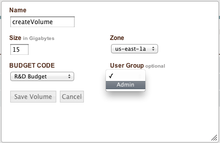

Snapshots
---------
Snapshots are the reciprocal of volumes. When a snapshot of a volume is created, a
differential backup of the devices is created and stored in S3. From this snapshot, a
clone of the original volume can be created. enStratus leverages this property of
snapshots when automating application deployments. At the time of this writing, snapshot
creation is only supported by the Amazon EC2 cloud.

Creating Volumes from Snapshots
~~~~~~~~~~~~~~~~~~~~~~~~~~~~~~~

Creating volumes from snapshots is a way to create an exact duplicate of the volume from
which the snapshot came. If the filesystem on the volume supports increasing the size of
the volume, the volume created from the snapshot may be increased in size.

The volume created from the snapshot must be at least the size of the original volume.

To create a volume from a snapshot, navigate to Infrastructure > Snaphots and select a
snapshot. Click on the appropriate actions button and choose create_volume. The resulting
dialog box allows for the customization of several options, including standard enStratus
options of name, group, and billing code.

The size field will automatically be populated with the size of the original volume, but
can be increased. For Amazon, volumes are specific to an availability zone, so a zone is
required for volume creation.

   Create Volume from Snapshot

The created volume will soon appear in the Infrastructure > Volumes page for selection and
attachment to servers.

Sharing Snapshots
~~~~~~~~~~~~~~~~~
Sometimes it is advantageous to share snapshots to another account for ease of data
transfer. Sharing snapshots in enStratus is accomplished by selecting the snapshot to
share and clicking on the action button choosing sharing.

A dialog box with two primary options is presented. The first share type is Private.
Private sharing enables an enStratus user who is a part of several accounts to share
snapshots between those accounts. The accounts of which the user is a part will populate a
dropdown window. Once the snapshot is shared, the snapshot will appear in the other
account.

The second share type is Public. Public sharing enables an enStratus user to add a
snapshot to the publicly available pool of snapshots. This is an option that carries the
risk of making publicly available private data, so this action should be restricted using
enStratus groups and roles.

Snapshot Strategies
~~~~~~~~~~~~~~~~~~~
Because snapshots are differential backups, the time snapshots take to create varies based
on the amount of changed information since the last snapshot was taken. Frequent snapshots
will generally be created more quickly than infrequent ones.

In an automated environment with enStratus, it is possible to have enStratus automate both
the creation of snapshots and recovery volumes according to a customizable schedule.
