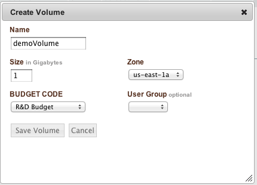

.. Volumes
ボリューム
-------

.. Overview
概要
~~~~~~~~
.. Volumes represent block storage. Conceptually, storage devices can be used to store data in a persistent manner in the cloud.
ボリュームは、ブロックストレージを表します。概念的には、ストレージデバイスは、クラウド内のデータを永続的な方法で
格納するために使用することができます。

.. Creating Volumes
ボリュームの作成
~~~~~~~~~~~~~~~~
.. To create a new volume, navigate to Infrastructure > Volumes. If volumes had been
   previously created either within enStratus or via the cloud provider, they will be listed
   in the volumes table. Select +create_volume and complete the resulting dialog box.
新規のボリュームを作成するには、 Infrastructure > Volumes に移動します。
ボリュームが以前にenStratus内またはクラウドプロバイダのいずれかを介して作成されていた場合、それらは
ボリュームテーブルに表示されます。 +create_volume を選択し、表示されるダイアログボックスを完了します。

   Create Volume

.. The name of the volume is a logical name that will be used within enStratus to reference
   the volume. The size of the volume is should be between 1 and 1000 gigabytes (1 Tb).
ボリュームの名前はenStratus内でボリュームを参照するために使用される論理名です。
ボリュームのサイズは1〜1000ギガバイト（1 TB）である必要があります。

.. The Zone in which a volume is created is important because volumes may only be attached to
   servers in the same zone. Billing code and group complete the creation options for a
   volume.
ボリュームは同じゾーン内のサーバーのみに取り付けることができるため、ボリュームが作成されるゾーンは重要です。
課金コードとグループはボリュームの作成オプションを完了します。

.. Volume creation takes only a few minutes to complete. Once the volume is created it will
   be added to the list of volumes. Since newly created volumes are not attached to a server,
   the Device and Current Server columns will be blank.
ボリュームの作成が完了するまでほんの数分しかかかりません。一度ボリュームが作成されると、それは、
ボリュームのリストに追加されます。新しく作成されたボリュームは、サーバーに接続されていないので、
デバイスと現在のサーバーのカラムは空白になります。

.. figure:: ./images/finishedVolume.png
   :height: 400px
   :width: 1600 px
   :scale: 50 %
   :alt: Volume Created
   :align: center

   Volume Created

.. Attaching Volumes
ボリュームの接続
~~~~~~~~~~~~~~~~~
.. Volumes and servers must share an availability zone for volume attachment to succeed.
   Volumes are attached as block storage devices and are neither partitioned nor formatted
   when attached. enStratus allows for automated attachment, formatting, and mounting of new
   volumes only when starting a new server.
ボリュームとサーバーは、ボリュームの接続が成功するためには可用性ゾーンを共有する必要があります。
ボリュームは、ブロックストレージデバイスとして接続された時は、パーティション作成もフォーマットもされていません。
enStratusは、新規サーバーを起動する場合にのみ自動化された接続、フォーマッティング、新規ボリュームのマウンティングを
可能にします。

.. To attach a volume to a server, select the volume for attachment and select the green
   actions button. The only required information to attach a volume is the name of the server
   to which the volume will be attached. The list of servers that share an availability zone
   will populate the dropdown selector.
サーバーへボリュームをアタッチするには、接続するボリュームを選択し、緑色のアクションボタンを選択します。
ボリュームをアタッチするための唯一の必要な情報はボリュームが接続されるサーバーの名前です。
アベイラビリティゾーンを共有するサーバーのリストはドロップダウンセレクタに存在します。

.. Optionally, a device name may be selected for the volume. In this case, I have chosen a
   device name of sdh, which means the device will appear as /dev/sdh on the server:
オプションとして、デバイス名を、ボリュームのために選択することができます。このケースでは、選択した
デバイス名の sdh は、デバイスがサーバー上では /dev/sdh として表示されることを意味します。

.. code-block:: bash

  p335@ApplicationServer:~$ sudo fdisk -l

  Disk /dev/sdh: 2147 MB, 2147483648 bytes 255 heads, 63 sectors/track, 261 cylinders Units
  = cylinders of 16065 * 512 = 8225280 bytes Sector size (logical/physical): 512 bytes / 512
  bytes I/O size (minimum/optimal): 512 bytes / 512 bytes Disk identifier: 0x00000000

  Disk /dev/sdh doesn't contain a valid partition table

.. Once the volume is attached, it can be considered and treated somewhat like an external
   hard drive attached to the server. Standard hard drive activities are available including
   partitioning, formatting, and mounting.
ボリュームが接続されれば、やや外部ハードドライブがサーバーに接続されているかのようにみなして、
扱うことができます。パーティショニング、フォーマット、およびマウントを含む標準的な
ハードディスクドライブのアクティビティを利用できます。

.. Creating Snapshots
スナップショットの作成
~~~~~~~~~~~~~~~~~~
.. Snapshots are created from volumes and volumes are created from snapshots.
スナップショットはボリュームから作成され、ボリュームがスナップショットから作成されます。

.. A snapshot of a volume represents a differential backup of the data contained on the
   volume. This means that only the blocks that have changed are saved each time a snapshot
   is created. To create a snapshot, select the green actions button for the volume, and
   choose make_snapshot. The only required information to create the snapshot is a logical
   name for the snapshot. Once the snapshot is saved, the snapshot will appear in the
   snapshots page in the enStratus console.
ボリュームのスナップショットはボリュームに含まれるデータの差分バックアップを表します。
これは、変更されたブロックのみがスナップショットが作成されるたびにを保存されることを意味します。
スナップショットを作成するには、ボリュームの緑色のアクションボタンを選択し、
make_snapshotを選択します。スナップショットを作成するために必要な情報はスナップショットの論理的名前だけです。
スナップショットが保存されると、スナップショットは、enStratusコンソールのスナップショットのページで表示されます。

.. Deleting Volumes
ボリュームの削除
~~~~~~~~~~~~~~~~
.. To delete a volume, click on the green action button associated with the volume and choose
   delete. A dialog box will prompt you to confirm the action and the volume will be removed
   from the volumes list.
ボリュームを削除するには、ボリュームに関連付けられた緑色のアクションボタンをクリックして[削除]を選択します。
現れたダイアログボックスで、表示されたプロンプトに応じてアクションを確認すると
ボリュームがボリュームリストから削除されます。

.. Volume Strategies
ボリューム戦略
~~~~~~~~~~~~~~~~~
.. Volume storage is often persistent beyond the life of the server to which it was attached.
   This makes volumes a very useful item for managing data storage in the cloud. In a
   high-availability failure-tolerant automated environment, enStratus leverages volumes to
   restore applications to an operational state without data loss.
ボリュームストレージは、しばしば、それが接続されたサーバの寿命を超えて永続的です。
これはボリュームがクラウドでデータストレージを管理するための非常に有用なアイテムになります。
高可用性の障害トレラント自動化された環境において、enStratusは、データ損失することなく
アプリケーションを復元しボリュームを動作状態に戻すことに活用します。
