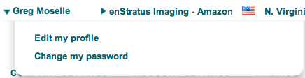
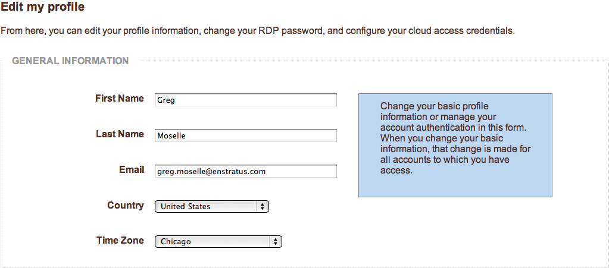
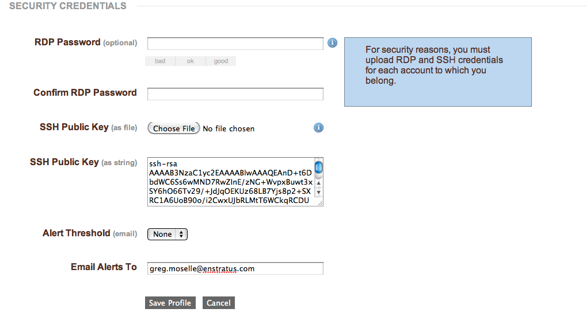

Managing Users
--------------
The challenge of user management breaks down roughly along two boundaries. The first of
which is enStratus console access and the second is access rights to an individual cloud
resource such as a server.

The elasticity inherent in cloud computing creates a unique challenge for enterprise shell
and remote desktop access. enStratus operates as an arbiter between your authoritative
user database and user access to cloud virtual machines. Because of this arbitration, your
cloud virtual machines do not need to participate in any kind of trust relationship with
a corporate directory service.

enStratus acts as this arbiter by adding individual user accounts to virtual machines
based on the users enStratus access rights to that VM. enStratus maintains a separate set
of login credentials for VM access so that corporate passwords are never placed in a
public cloud.

Any enStratus user may be granted shell/remote desktop access to a cloud virtual machine
if that user has shell access rights to that virtual machine. If you want to grant a user
access to a virtual machine, they must have first created Linux (SSH) or Windows
(password) credentials in enStratus. You can then select the virtual machine to which they
should be granted access and then grant them access to the virtual machine. When you grant
that access, a new user account is created on the virtual machine with that users
authentication credentials.

If you remove the user from enStratus, enStratus also removes all virtual machine access
as well.

To create a new user, navigate to User Manager > Users. Click on the + add user link in
the upper right of the User List and complete the resulting dialog box. After providing
the required information the user will be added to the user list.

.. figure:: ./images/newUserDialog.png
   :height: 800px
   :width: 1000 px
   :scale: 50 %
   :alt: New User
   :align: center

   New User

Once the user is added to the system, they will inherit the rights associated with the
group(s) to which they have been added.

A user must specify remote access credentials prior to gaining access to individual
running servers in the cloud. To gain access to a running Windows server, the user must
specify an RDP password. To access a Linux server, a user must specify a public SSH key.

To associate these credentials, click on their name at the top of the console, and select
Edit my profile. On the profile page, the RDP password should be entered twice before
saving the changes to the profile. The SSH public key can be entered either as a string or
uploaded as a file.

   Edit Profile

Once the credentials have been entered and the profile is saved, the user can then access
remote servers as outlined in the Infrastructure > Servers section through Shell/Remote
access provided they have the appropriate access rights to take this action.

   General Profile Information

|

   Profile Security Credentials

