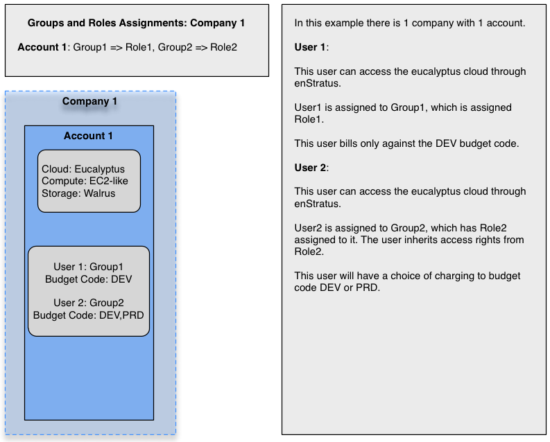

Users
=====
User management with enStratus is tightly integrated with enStratus accounts, groups,
roles, and budget codes. Let's define a few terms that will help provide useful
context for understanding how users work.

#. Company. A company is a logical entity in enStratus that contains one or more accounts.
   When the first account is created, a company name is required.
#. Account. A account has a one to one relationship with a set of cloud credentials tied
   to a cloud provider.
#. Group. A group is visible company-wide. Users can be assigned one or more groups. Each
   group can have 0 or 1 role applied to it.
#. Role. A role is also visible company-wide. Roles are the mechanism through which access
   rights are managed. A role of the same name may have different access rights applied on
   the account level.
#. Budget Code. Budget codes are visible company-wide and costs are aggregated across all
   accounts.

.. figure:: ./images/companies.png
   :height: 800px
   :width: 1000 px
   :scale: 50 %
   :alt: Companies and Accounts
   :align: center

   Companies and Accounts

In the above example, we have two companies being managed through enStratus and tied to one
or more cloud accounts. Let's take a closer look at each company.

   Company One

The first company example is a simple example showing one company and one account. Here
there are only two users, each having potentially differing levels of access to the
underlying cloud depending on how their respective roles are configured. Group one is
assigned role one and group two is assigned role 2.

It is possible that role 1 and role 2 are identical and therefore each user will have the
same capabilities, although doing so is not practical.

The other primary difference between these two users is at the level of the bugdet code.
User 1 has only one budget code against which to charge, in this case the code called DEV.
User 2 has access to both the DEV and PRD budget codes.

.. figure:: ./images/companyTwo.png
   :height: 800px
   :width: 1000 px
   :scale: 50 %
   :alt: Company Two
   :align: center

   Company Two

Company two displays a more complex account relationship with more users, groups, and
roles. Here, there are two groups and three roles.

The first highlight to notice is that the group definitions for group 1 are different in
each account. In account 1, group one is assigned role 1, in account 2, group one is
assigned role 3. The practicality of such a design depends on what you’re trying to
accomplish in each account.

The effect of such a group and role mapping is on User 1. If User 1 is operating in the
first account, tied to AWS in this case, he or she will inherit the access rights from
Role 1. If User 1 switches to the second account, tied to OpenStack, they inherit access
rights from Role 2.

The other interesting user in this case is User 3. This user as been assigned into two
groups, Groups 1 and 2. When a user is assigned into two groups, the User inherits the sum
of the access rights. So in this case, User 3 is inheriting access rights from role 3 and
role 2, which are assigned to groups 1 and 2, respectively.

Budget codes for company 2 are visible across the entire company. This means charges to
the DEV and PRD budget codes, regardless of account, will aggregate and be shown in the
companies budget code summary. Users can be assigned into one or many budget codes.

.. include:: user_profile.rst
.. include:: roles.rst
.. include:: access_rights.rst
.. include:: example_roles.rst
